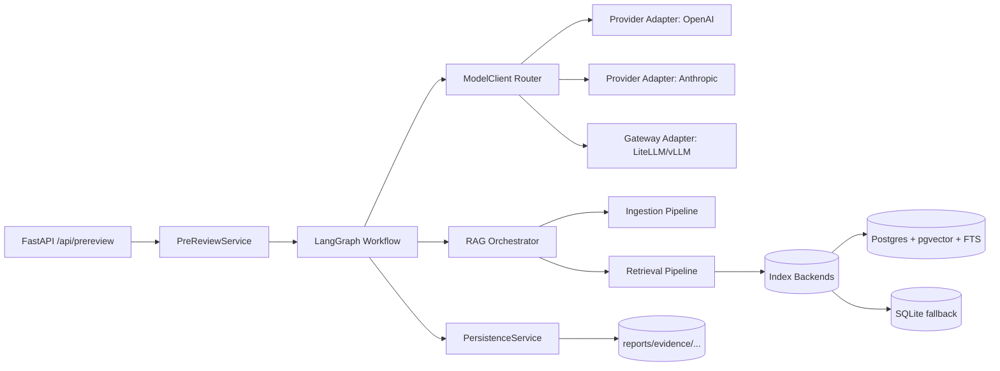
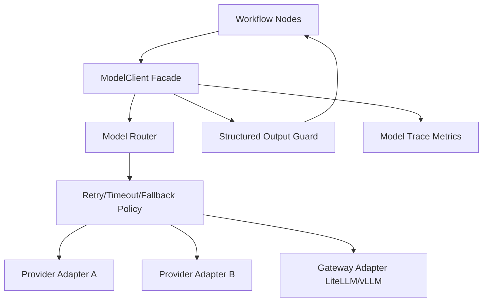
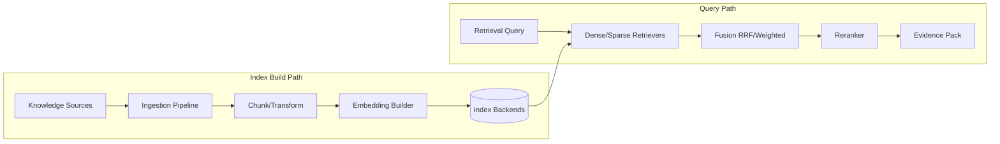
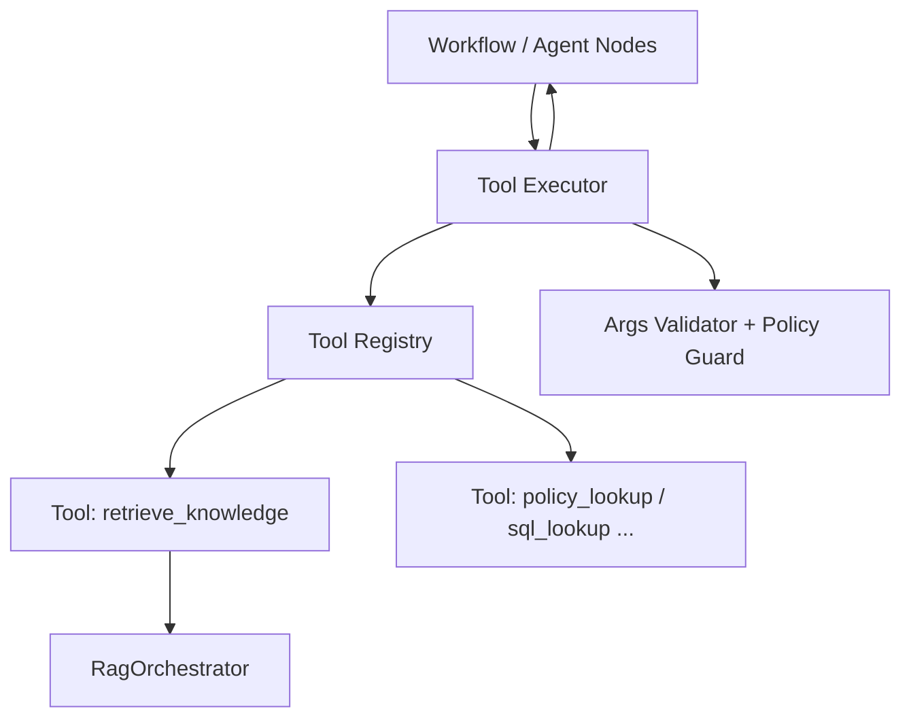

# 总体技术设计方案 - agent

> Version: v0.2.0
> Last Updated: 2026-03-13
> Status: Draft

## 1. 背景与目标

当前系统的预审 Agent 已具备可运行骨架（LangGraph + HeuristicModelClient + 本地混合检索），但在智能能力与工程可扩展性上仍有明显短板：

1. 大模型能力仅为本地启发式实现，无法提供生产级推理质量。
2. RAG 检索是单体实现，缺乏分层与插件化扩展能力。
3. 观测与回放能力不足，无法支撑模型路由、成本、检索质量的持续优化。

本需求目标：

1. 接入云端 AI 能力，构建可路由、可降级、可观测的 `ModelClient` 体系。
2. 建设分层级可插拔 RAG 系统，使 Agent 可按场景启用 dense/sparse/hybrid/rerank 能力。
3. 保持现有预审业务接口兼容，采用增量演进方式上线。
4. 将 RAG 封装为标准 Tool，为后续 LLM tool calling 扩展做协议与执行层准备。

## 2. 范围（In/Out）

### In Scope

1. ModelClient 抽象升级：provider registry、模型路由、fallback、重试、结构化输出校验。
2. 云模型接入：优先 OpenAI-compatible 路径（可直连云厂商或 LiteLLM/vLLM 网关）。
3. RAG 分层：Ingestion、Index、Retrieval、Fusion、Rerank、Evidence 组装。
4. RAG 插件机制：可替换 embedding、vector backend、reranker、query planner。
5. 预审接口增量扩展：增加 `debug/trace` 观测字段（向后兼容）。
6. 前端最小协同：展示运行时 trace 信息与重建索引入口（管理页）。
7. Tool 抽象层：定义 `ToolSpec/ToolContext/ToolResult`，先落地 `retrieve_knowledge`。
8. Tool 调用治理：调用次数上限、超时、参数校验、审计埋点。

### Out of Scope

1. 全量多租户知识治理平台（仅提供接口与数据模型扩展位）。
2. 复杂在线学习/反馈强化回路（仅保留评估数据采集点）。
3. 完整 BI 报表系统（仅实现基础 metrics/log 埋点）。
4. 外部工具市场或任意用户自定义工具执行（当前仅系统内置工具）。

## 3. 总体架构与关键流程

### 3.1 开源方案调研结论（官方资料）

| 项目 | 可借鉴设计 | 采用方式 |
|---|---|---|
| LangGraph | checkpoint/persistence、retry policy、stateful graph | 继续作为编排核心，补 checkpoint + retry 配置 |
| LiteLLM | 统一多 provider 接口、fallback/router、网关模式 | 作为推荐网关模式（可选），统一云模型接入口 |
| LlamaIndex | IngestionPipeline、Transformations、Router/Recursive/AutoMerging retriever | 用于设计分层 RAG 的 ingest/retrieve 插件接口 |
| Haystack | Component/Pipeline、AsyncPipeline、SuperComponent、Hybrid retriever | 用于定义可插拔组件和并行检索执行模型 |
| pgvector | Postgres 向量 + FTS hybrid、RRF/重排组合建议 | 作为生产主存储路线（SQLite 保留 dev fallback） |
| vLLM | OpenAI-compatible server | 作为私有模型/自托管推理接入选项 |

### 3.2 目标架构

### 3.3 ModelClient 分层示意

说明：

1. 节点只依赖统一 Facade，不感知具体 provider。
2. Router+Policy 负责主备切换与失败恢复，避免把重试逻辑散落到节点。
3. Structured Output Guard 在回传节点前统一做 schema 校验和修复。

### 3.4 RAG 分层示意

说明：

1. Offline 与 Online 解耦，索引构建不会阻塞在线预审主链路。
2. Retrieval/Fusion/Rerank 都是可替换组件，符合“可插拔”目标。
3. 同一个查询可以同时走 dense 和 sparse，再在 fusion 层汇总。

### 3.5 关键流程

### 3.5 Tool Layer 分层示意

说明：

1. Workflow 不直接依赖 RAG 实现细节，统一通过 Tool Executor 调用。
2. Tool Registry 用于插件注册，支持后续新增工具但不影响节点编排。
3. Guard 层统一治理工具参数、调用预算与超时策略。

### 3.6 关键流程

> Obsolete in v0.2.0: 原关键流程将 RAG 视为节点内部直接调用模块。  
> Replacement in v0.2.0: RAG 通过 `retrieve_knowledge` Tool 由 Tool Executor 调用，后续可平滑接入 LLM tool calling。

1. 预审执行：`PreReviewService -> Workflow -> ModelClient + RAG -> PersistenceService`。
2. 模型调用：Router 按策略选择 provider，失败时 fallback，统一输出结构化结果。
3. Tool 化检索：`query plan -> ToolExecutor(retrieve_knowledge) -> dense/sparse/hybrid -> fusion -> rerank -> evidence`。

## 4. 数据与状态模型

### 4.1 运行状态扩展（工作流 state）

新增建议字段：

1. `model_trace`: provider/model/latency/token/cost/fallback_path
2. `retrieval_trace`: strategy/index_backend/candidate_count/fusion/rerank
3. `debug_flags`: include_trace / retrieval_mode override
4. `tool_trace`: tool_name/latency/call_count/args_summary/status

### 4.2 持久化扩展（建议）

1. `reports.report_json` 增加 `trace` 节点（向后兼容，optional）。
2. 新增 `knowledge_sources`（知识源定义）与 `knowledge_sync_jobs`（索引构建任务）。
3. `knowledge_chunks` 增加稀疏向量或 BM25 字段扩展位（按 backend 决定）。
4. 新增 `tool_call_logs`（可选）：记录工具调用输入摘要、结果状态与耗时。

## 5. 阶段规划（Phase 1..N）

### Phase 1：云模型接入最小闭环

1. 建立 provider adapter 抽象。
2. 接入至少 1 个云模型 provider（OpenAI-compatible）。
3. 保持现有 workflow 节点调用方式不破坏。

### Phase 2：模型路由与可靠性

1. 增加 model router（主模型 + fallback 模型）。
2. 增加重试、超时、熔断与错误分类。
3. 埋点 token/cost/latency。

### Phase 3：分层 RAG 基础设施

1. 拆分 ingestion/index/retrieval/fusion/rerank 接口。
2. 实现默认 hybrid retriever（dense + sparse + rerank）。
3. 支持 SQLite fallback 与 PostgreSQL 主线路。

### Phase 4：可插拔与运维能力

1. 增加 index backend 插件注册。
2. 增加 reindex 管理接口与最小前端入口。
3. 增加检索质量评估样本与离线回归脚本。

### Phase 5：Tool 化与 Tool Calling 预留

1. 将 RAG 能力封装为内置 `retrieve_knowledge` tool。
2. 引入 Tool Executor + Registry + Policy Guard。
3. 新增 LLM tool-calling 适配层（默认可关闭），保持非 tool-calling 路径可回退。

## 6. 风险与回滚策略

1. 云模型调用不稳定导致预审失败率上升。
2. RAG 分层改造引入性能回退。
3. provider 返回格式差异导致 structured output 不稳定。
4. PostgreSQL/pgvector 与本地 SQLite 行为差异导致联调问题。

回滚策略：

1. `COPRODUCT_MODEL_MODE=heuristic` 开关一键回退本地模型。
2. `COPRODUCT_RAG_MODE=legacy` 回退现有 `HybridSearcher` 单体实现。
3. 新字段全部 optional，不破坏旧前端解析。
4. `COPRODUCT_TOOL_MODE=disabled` 可关闭 Tool Executor，回到直接函数调用路径。

## 7. 需求台账（TD-*）

| TD-ID | 需求描述 | Owner(FE/BE/BOTH) | Priority | 备注 |
|---|---|---|---|---|
| TD-001 | 构建 provider-agnostic ModelClient 抽象 | BE | P0 | 保持现有节点调用兼容 |
| TD-002 | 接入云端模型并支持主备路由/fallback | BE | P0 | 至少一个 provider 可用 |
| TD-003 | 结构化输出校验与错误恢复策略 | BE | P0 | 减少 schema 漂移 |
| TD-004 | 模型调用观测（latency/token/cost） | BOTH | P1 | FE 展示最小 trace |
| TD-005 | RAG 分层接口（ingest/index/retrieve/rerank） | BE | P0 | 插件化核心 |
| TD-006 | hybrid retrieval（dense+sparse+fusion） | BE | P0 | 支持质量提升 |
| TD-007 | RAG backend 可插拔（pgvector 优先） | BE | P1 | SQLite fallback |
| TD-008 | 预审接口增量扩展并保持兼容 | BOTH | P0 | 不破坏现有调用 |
| TD-009 | 管理端重建索引入口与状态可见性 | BOTH | P1 | 最小可运维能力 |
| TD-010 | 联调验收与回滚开关落地 | BOTH | P0 | 发布门禁 |
| TD-011 | 将 RAG 封装为标准 Tool 并接入执行器 | BE | P0 | 后续 tool calling 前置条件 |
| TD-012 | 预留 LLM tool-calling 协议适配层 | BOTH | P1 | 默认可关闭，先内测 |

## 8. 风险-缓解-实现映射

| Risk-ID | 风险描述 | 缓解策略 | 技术实现（模块/接口/数据） | 验收项 |
|---|---|---|---|---|
| R-001 | 云模型抖动或限流 | 主备模型 + 指数退避重试 + 熔断 | `model_client/router.py`，provider policy 配置 | AC-BE-003 |
| R-002 | 结构化输出不合法 | schema validate + repair/retry + 降级默认值 | `model_client/structured_output.py` | AC-BE-004 |
| R-003 | 检索性能/质量不稳定 | 分层 pipeline + 并行检索 + fusion/rerank 参数化 | `rag/pipeline/*` | AC-BE-007 |
| R-004 | 新架构影响线上稳定性 | feature flags + 双轨运行 + 可回退 legacy | 配置开关 + `legacy` adapter | AC-E2E-004 |
| R-005 | 前后端契约不一致 | 明确 FC/BC 字段语义 + 自动一致性检查 | `04/05` + consistency script | AC-E2E-002 |
| R-006 | Tool 参数失控或过度调用导致延迟/成本上升 | 参数 schema 校验 + max_tool_calls + 超时熔断 | `tool_executor.py` + policy config | AC-BE-010 |

## 9. 参考开源资料（调研来源）

1. LangGraph overview & persistence: https://docs.langchain.com/oss/python/langgraph
2. LangGraph graph API/retry: https://docs.langchain.com/oss/python/langgraph/use-graph-api
3. LiteLLM docs (router/proxy/unified API): https://docs.litellm.ai/
4. LlamaIndex ingestion pipeline: https://docs.llamaindex.ai/en/stable/module_guides/loading/ingestion_pipeline/
5. LlamaIndex router/recursive/auto-merging retrievers:
- https://docs.llamaindex.ai/en/stable/api_reference/retrievers/router/
- https://docs.llamaindex.ai/en/stable/api_reference/retrievers/recursive/
- https://docs.llamaindex.ai/en/stable/api_reference/retrievers/auto_merging/
6. Haystack pipelines/async/supercomponents/hybrid retrievers:
- https://docs.haystack.deepset.ai/docs/pipelines
- https://docs.haystack.deepset.ai/docs/asyncpipeline
- https://docs.haystack.deepset.ai/docs/supercomponents
- https://docs.haystack.deepset.ai/docs/opensearchhybridretriever
7. pgvector hybrid search guidance: https://github.com/pgvector/pgvector
8. vLLM OpenAI-compatible server: https://docs.vllm.ai/en/latest/serving/openai_compatible_server/
