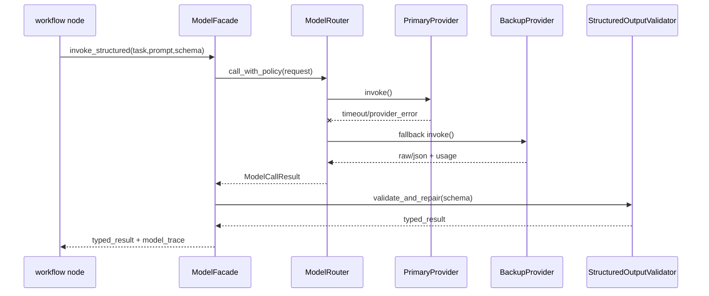
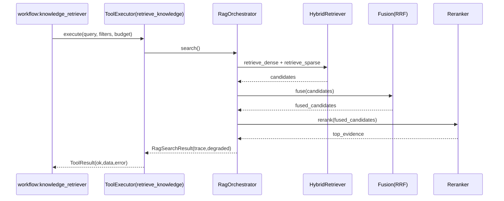
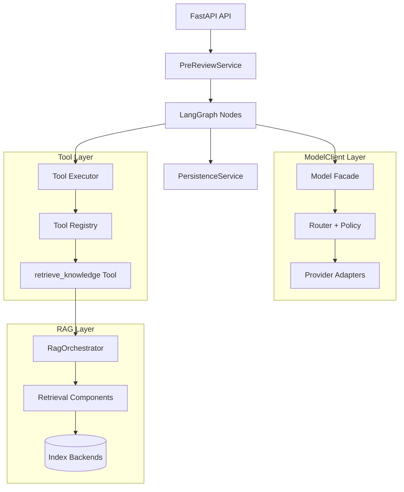
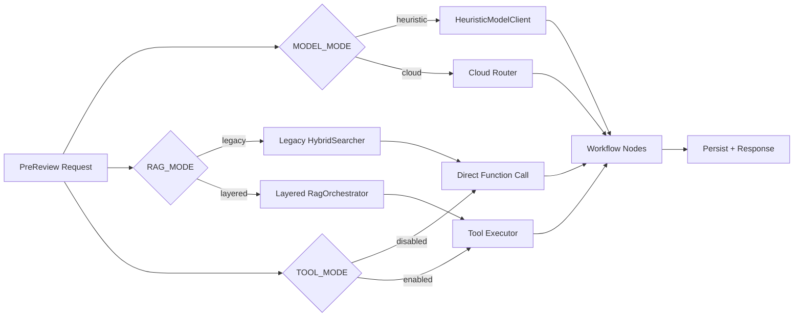

# 后端技术落地方案 - agent

> Version: v0.2.4
> Last Updated: 2026-03-13
> Status: Draft

## 1. 模块边界与服务分层

### 1.1 ModelClient 分层

为避免“模型调用逻辑散落在各节点”，ModelClient 采用 6 层结构，目标是可替换、可回滚、可观测。

| 层级 | 核心职责 | 关键能力 | MVP 默认实现 | 可插拔扩展点 | 失败/降级策略 |
|---|---|---|---|---|---|
| L0 Config & Policy (`model_client/config.py`) | 汇总模型运行配置并做合法性校验 | mode/provider/model/timeout/retry/schema 策略解析 | 从 `COPRODUCT_MODEL_*` 环境变量加载 | 配置中心/多环境 profile | 非法配置启动即失败；提供 `heuristic` 安全默认 |
| L1 Interfaces (`model_client/interfaces.py`) | 统一模型能力协议，隔离业务层与供应商 SDK | `StructuredModel`/`EmbeddingModel`/`Reranker` 协议定义 | Python Protocol + Pydantic 输入输出约束 | 新能力协议（tool-calling planner 等） | 接口不匹配在构建期/单测阶段暴露 |
| L2 Providers (`model_client/providers/*`) | 适配具体云厂商 API | 请求组装、鉴权、响应解析、错误归类 | OpenAI-compatible provider | Anthropic/Bedrock/Azure OpenAI adapter | provider 报错归一为 `MODEL_PROVIDER_ERROR` 等错误码 |
| L3 Router (`model_client/router.py`) | 按策略选择 provider 并处理可靠性逻辑 | 主备路由、retry、fallback、timeout、熔断计数 | 单主+单备优先级路由 | 基于成本/延迟/可用率的动态路由 | 主路由失败自动切备；超限后降级 `heuristic` |
| L4 Facade (`model_client/facade.py`) | 对 workflow 提供稳定调用入口 | `invoke_structured`/`embed`/`rerank` 统一入口、trace 注入 | 节点统一调用 Facade | 场景化 facade（解析/评估/写作） | facade 捕获异常并返回可诊断错误 |
| L5 Factory (`model_client/factory.py`) | 统一装配依赖，控制 runtime 切换 | 按 mode 构建 cloud router 或 heuristic client | `MODEL_MODE=heuristic|cloud` | A/B dual-run 组装器 | 切换失败退回已知可用实例 |

#### 1.1.1 层间契约（输入/输出）

1. Workflow -> Facade 输入 `ModelTaskRequest`：`task`, `prompt`, `schema`, `context`, `trace_context`。
2. Facade -> Router 输入 `RoutedModelRequest`：附加 `task_type`, `policy`, `timeout_budget_ms`。
3. Router -> Provider 输入 `ProviderRequest`：供应商规范参数（model/messages/temperature/...）。
4. Provider -> Router 输出 `ProviderResponse`：`raw_text`, `json_payload`, `token_usage`, `latency_ms`。
5. Router -> Facade 输出 `ModelCallResult`：`data`, `provider`, `model`, `fallback_count`, `error_class`。
6. Facade -> Workflow 输出业务可消费结构：严格通过 schema 校验，不泄露 SDK 细节对象。

#### 1.1.2 默认实现的代码组织（后端）

```text
backend/app/model_client/
  config.py                  # 环境变量到策略对象映射
  interfaces.py              # 协议与类型定义
  structured_output.py       # schema validate + repair retry
  providers/
    base.py                  # Provider 抽象
    openai_compatible.py     # OpenAI/LiteLLM/vLLM 兼容适配
  router.py                  # fallback/retry/timeout/circuit
  facade.py                  # workflow 统一入口
  factory.py                 # runtime 组装与切换
  heuristic.py               # 本地启发式保底实现
```

说明：

1. workflow 节点禁止直接 import provider adapter，只依赖 facade。
2. provider 层只做“协议翻译”，业务 prompt 拼装在 workflow 或 service 层完成。
3. `structured_output.py` 负责“解析+修复+重试”闭环，避免每个节点重复实现。

#### 1.1.3 调用时序（云模型路径）



#### 1.1.4 能力边界与实现策略

1. 结构化输出：优先 provider 原生 JSON mode；失败后进入 repair prompt + 有限重试。
2. 可观测性：每次调用记录 `provider/model/latency/token/fallback_count/error_class`。
3. 成本治理：router 支持按任务类型配置模型档位（例如 parser 用低成本，composer 用高质量）。
4. 可靠性：超时与重试预算由 router 统一控制，节点层不自行 retry。
5. 回滚：`COPRODUCT_MODEL_MODE=heuristic` 一键回到本地启发式链路。

#### 1.1.5 实施步骤（怎么落地）

1. 第一步：抽离 interfaces + facade，先把现有 heuristic 能力接入 facade，保证节点调用面不变。
2. 第二步：引入 provider adapter（OpenAI-compatible）并接通 router，支持主备 fallback。
3. 第三步：接入 `structured_output.py`，统一 schema 校验与修复。
4. 第四步：补全 observability 指标和日志字段，建立延迟/成功率/成本基线。
5. 第五步：在灰度环境启用 `MODEL_MODE=cloud`，保留 heuristic 回滚路径。

### 1.2 RAG 分层

为避免“RAG 只是一个黑盒检索器”，后端实现明确拆为 7 层，每层可替换、可降级、可观测。

| 层级 | 核心职责 | 关键能力 | MVP 默认实现 | 可插拔扩展点 | 失败/降级策略 |
|---|---|---|---|---|---|
| L1 Ingestion (`rag/ingestion/*`) | 将原始知识源标准化为可检索 chunk | loader、清洗、切分、metadata enrich、embedding 触发 | 本地文件+文本 loader；固定 chunk 策略；同步入库 | 新增 loader（Confluence/Notion/Jira）、语义切分器、增量同步策略 | ingest 失败仅影响对应 source；标记 source 状态为 `failed`，不阻塞在线预审 |
| L2 Index (`rag/index/*`) | 提供统一索引读写接口 | 向量写入、元数据过滤、索引切换、版本化 | SQLite fallback + pgvector primary（二选一） | 向量库后端扩展（Milvus/Qdrant/ES） | index 不可用时返回 `RAG_INDEX_UNAVAILABLE`，可回退 legacy 检索路径 |
| L3 Retrieval (`rag/retrieval/*`) | 从不同检索器召回候选证据 | dense/sparse/hybrid、多路并行召回、按 org/source 过滤 | dense + keyword 双检索并行 | BM25/semantic hybrid 改进、query rewrite、多租户过滤器 | 单路检索失败不立即失败；保留另一条召回结果并打 trace |
| L4 Fusion (`rag/fusion/*`) | 合并多路召回并去重 | RRF/加权融合、重复片段聚合 | RRF 默认 | 权重学习、query-type 自适应融合 | fusion 失败则退化为 dense-only 排序 |
| L5 Rerank (`rag/rerank/*`) | 对候选证据做高精度重排 | cross-encoder/LLM rerank、topK->topN 压缩 | 轻量 rerank（启发式或小模型） | 云 reranker、领域特化 reranker | rerank 异常时返回 fusion 结果并记录 `RAG_RERANK_FAILED` |
| L6 Orchestrator (`rag/orchestrator.py`) | 编排 L1-L5，对上游暴露单一接口 | 参数归一、策略选择、trace 聚合、超时预算分配 | `search(query, filters, budget)` | 策略路由器（按场景切换 dense/hybrid） | orchestration 超时时返回可用部分结果 + degraded 标记 |
| L7 Tool Adapter (`tools/rag_retrieve_tool.py`) | 将 RAG 能力封装为工具调用单元 | schema 校验、tool trace、统一返回结构 | `retrieve_knowledge` 内置工具 | 未来多工具编排（web/tool calling） | tool 调用失败可回退 direct RAG 或空证据，不阻塞主流程 |

#### 1.2.1 层间契约（输入/输出）

1. L1 输出 `KnowledgeChunk[]`：`chunk_id`, `content`, `embedding_ref`, `metadata`。
2. L2 输出 `IndexRecord[]`：可被 L3 按 `org_id/source_id/tags` 检索。
3. L3 输出 `RetrievedCandidate[]`：`candidate_id`, `score`, `retriever_type`, `snippet`。
4. L4 输出 `FusedCandidate[]`：统一分数域并去重后的候选。
5. L5 输出 `Evidence[]`：用于报告写作的最终证据集合（含引用信息）。
6. L6 输出 `RagSearchResult`：`evidence`, `trace`, `degraded`, `latency_ms`。
7. L7 输出 `ToolResult`：`ok`, `data`, `error_code`, `trace_id`（对 workflow 统一）。

#### 1.2.2 默认实现的代码组织（后端）

```text
backend/app/rag/
  ingestion/
    base.py                 # Loader/Chunker/Embedder 协议
    pipeline.py             # ingest 编排
  index/
    base.py                 # IndexStore 抽象
    sqlite_store.py         # SQLite fallback
    pgvector_store.py       # Postgres pgvector
  retrieval/
    dense.py                # 向量检索
    sparse.py               # 关键词检索
    hybrid.py               # 并行召回
  fusion/
    rrf.py                  # Reciprocal Rank Fusion
  rerank/
    heuristic_reranker.py   # MVP rerank
    model_reranker.py       # 云模型 rerank 适配器（预留）
  orchestrator.py           # 对 workflow 暴露 search()
```

说明：

1. 业务节点只允许调用 `RagOrchestrator`（或其 tool 包装），不允许绕过层级直接访问 index。
2. 每层必须有可替换接口，避免把 provider/sdk 细节渗透到 workflow。
3. trace 字段在 orchestrator 聚合，避免上层拼接碎片日志。

#### 1.2.3 检索时序（在线预审路径）



#### 1.2.4 实施策略（怎么落地）

1. 第一步：先实现 L6 orchestrator 外壳，保持内部可调用现有 legacy 检索器，确保不改上游节点行为。
2. 第二步：替换 L3/L4/L5 为真实分层实现，保留 `COPRODUCT_RAG_MODE=legacy|layered` 双轨开关。
3. 第三步：接入 L7 tool adapter，让 `knowledge_retriever` 改为 tool 调用；保留 direct fallback。
4. 第四步：补 observability（每层 latency/hit/degrade 指标），形成性能与效果基线。
5. 第五步：在不改业务 API 契约前提下，逐步替换具体后端（pgvector 主、SQLite 备）。

### 1.3 Tool 抽象层（新增）

1. `tools/base.py`
- 定义 `ToolSpec`, `ToolContext`, `ToolResult`。
2. `tools/registry.py`
- 维护可注册工具（name -> handler）。
3. `tools/executor.py`
- 统一执行器：参数校验、超时、重试、调用预算、审计日志。
4. `tools/rag_retrieve_tool.py`
- 将 `RagOrchestrator.search()` 封装为 `retrieve_knowledge` tool。
5. `tools/adapters/llm_tool_calling.py`（预留）
- 将模型 function-calling 协议映射到内部 Tool Executor。

### 1.4 分层调用关系图



说明：

1. workflow 节点只依赖 Facade/Executor，不直接调用具体 provider/index backend。
2. ToolLayer 将“能力调用”和“能力实现”解耦，RAG 只是其中一个工具。
3. PersistenceService 继续作为状态收口边界，保持事务一致性。

## 2. 接口与流程编排

### 2.1 预审流程改造点

在不改变现有节点拓扑的前提下，增量改造以下节点：

1. `requirement_parser/retrieval_planner/...` 使用路由型 model client。
2. `knowledge_retriever` 改为调用 `ToolExecutor.execute("retrieve_knowledge", ...)`。
3. `report_composer` 写入 trace 信息到 report payload。

> Obsolete in v0.2.0: `knowledge_retriever` 直接调用 `RagOrchestrator.search()`。  
> Replacement in v0.2.0: 统一走 Tool Executor，RAG 作为内置 Tool 实现。

### 2.2 新增管理流程

1. `GET /api/agent/runtime`
- 返回当前模型路由与 RAG backend 能力。
2. `POST /api/admin/agent/reindex`
- 提交重建任务（同步 MVP 或后台任务占位）。

### 2.3 运行时路径（含开关）示意



说明：

1. 三个开关独立：模型、RAG、Tool 执行器可单独切换，便于灰度和回滚。
2. 任一新链路不稳定时都能回到旧路径，降低发布风险。

### 2.4 预审提交异步化（Phase 1.5 紧急项）

> Obsolete in v0.2.2: `POST /api/prereview*` 请求线程同步执行完整 workflow。  
> Replacement in v0.2.3: 请求线程只做“受理 + 入队/调度”，workflow 在后台执行。

目标：

1. 提交接口快速返回（目标 < 3s），避免前端 15s 网络超时。
2. 执行失败与成功通过 session 状态查询反馈，不在提交请求内阻塞。

后端实现建议：

1. `create_prereview/regenerate_prereview`：
- 只负责创建 request/session、初始化状态为 `PROCESSING`、提交后台执行任务。
- 请求线程内禁止调用完整 `workflow.invoke`，避免长耗时阻塞。
2. 新增 `workflow_runner`（进程内队列 + worker）：
- 使用 `asyncio.Queue(maxsize=N)` 作为受理缓冲层，`enqueue_timeout_ms` 控制入队超时。
- worker 循环消费任务，调用统一 workflow entrypoint 执行预审。
- 成功时调用 `PersistenceService.persist_workflow_result`。
- 失败时调用 `persist_workflow_failure` 并记录 `WORKFLOW_ERROR` 细分原因。
3. 接口兼容策略：
- 保持响应结构不变：`{ sessionId, status: "PROCESSING" }`。
- 建议响应码为 `202 Accepted`，兼容 `200`。
- 允许通过 header 或日志标注 `submission_mode=async` 便于排障。

#### 2.4.1 Runner 组件设计（Phase 1.5 必须实现）

1. 组件职责：
- `SubmissionService`：校验参数、创建 session/request、生成 `TaskEnvelope` 并入队。
- `WorkflowQueue`：只负责排队和背压，不包含业务逻辑。
- `WorkflowRunner`：启动 worker、消费任务、调用 workflow、写回状态。
- `WorkflowExecutor`：封装实际执行入口，统一捕获和分类异常。

2. `TaskEnvelope` 最小字段：
- `session_id`
- `request_id`
- `org_id`
- `actor_user_id`
- `attempt`
- `submitted_at`
- `trace_id`

3. Worker 执行原则：
- 每次任务执行应用 `task_timeout_ms` 上限。
- 可重试错误仅允许有限次（`max_retries`），避免死循环。
- 不可重试错误直接失败并落库，状态进入 `FAILED`。
- `queue.task_done()` 必须在 `finally` 执行，避免队列阻塞。

#### 2.4.2 生命周期与恢复策略（Phase 1.5 必须实现）

1. Startup：
- 初始化 `WorkflowRunner`，启动 `worker_count` 个消费协程。
- 扫描数据库中“未终态 session（PROCESSING）”，按策略补入队列（recover）。

2. Shutdown：
- 停止接收新任务（关闭 enqueue）。
- 优雅等待队列 drain（可配置超时），超时则记录告警并退出。

3. 崩溃恢复：
- 因队列在内存中，重启后必须依赖 DB recover 扫描恢复执行。
- recover 任务应避免重复执行（基于 session 终态与 attempt 控制）。

#### 2.4.3 受理失败与背压策略（Phase 1.5 必须实现）

1. 队列满：
- 返回 `SUBMISSION_QUEUE_FULL`（429/503）。
2. 入队超时：
- 返回 `SUBMISSION_TIMEOUT`（504/500）。
3. 幂等保护：
- 对同一业务请求支持 `idempotency_key`（可先 header 透传），减少重复提交造成的重复任务。
4. 可观测性：
- 至少记录 `queue_depth`, `accepted_count`, `enqueue_failed_count`, `worker_busy`, `avg_execute_ms`。

## 3. 持久化与一致性策略

### 3.1 数据表增量

1. `knowledge_sources`
- 知识源定义（source_type, uri, status, sync_cursor）。
2. `knowledge_sync_jobs`
- reindex 任务记录（job_id, status, started_at, finished_at, error_message）。

### 3.2 一致性策略

1. reindex 采用“写新索引后切换”或“job 状态可见 + 幂等重试”。
2. `report_json.trace` 仅追加字段，不破坏旧结构。
3. 预审主事务与索引重建任务分离，避免长事务阻塞。

## 4. 模型/工具接入策略

### 4.1 云模型接入

1. 默认实现：OpenAI-compatible adapter。
2. 推荐部署模式：
- 直连云厂商 API。
- 或经 LiteLLM/vLLM 网关统一接入。

### 4.2 结构化输出策略

1. 第一层：provider 原生 JSON mode / response_format。
2. 第二层：Pydantic schema validate。
3. 第三层：repair prompt + retry（有限次）。
4. 失败降级：返回保守默认值并记录 `model_trace.error_class`。

### 4.3 RAG 策略

1. 检索模式：`dense`, `sparse`, `hybrid`。
2. `hybrid` 默认：dense topK + sparse topK -> fusion -> rerank -> topN evidence。
3. 融合算法默认 RRF，可配置权重。

### 4.4 Tool 执行策略

1. 每次预审默认最大工具调用次数：`max_tool_calls=3`（可配置）。
2. 每次工具调用必须经过参数 schema 校验。
3. 工具超时默认 2s（可按 tool 覆盖）。
4. 工具失败时支持降级（例如回退 direct rag search 或返回空证据）。

## 5. 错误处理与可观测性

1. 模型错误分类：`MODEL_TIMEOUT`, `MODEL_RATE_LIMIT`, `MODEL_SCHEMA_ERROR`, `MODEL_PROVIDER_ERROR`。
2. RAG 错误分类：`RAG_INDEX_UNAVAILABLE`, `RAG_QUERY_INVALID`, `RAG_RERANK_FAILED`。
3. 观测指标：
- model latency/token/cost/fallback_count
- retrieval latency/hit_count/empty_rate
- rerank latency/drop_ratio
 - tool call latency/success_rate/timeout_rate/call_count
4. 日志结构：在 `log_event` 中统一追加 `provider/model/request_id/session_id`。

## 6. 阶段映射（Phase 1..N）

1. Phase 1：ModelClient 抽象升级 + 单 provider 云接入。
2. Phase 1.5：预审提交异步化（提交/执行解耦，消除前端提交超时）。
3. Phase 2：Router + fallback + observability。
4. Phase 3：RAG 分层拆分 + hybrid pipeline。
5. Phase 4：reindex 管理接口 + 后端可运维能力。
6. Phase 5：RAG Tool 化 + tool-calling adapter 预留。

## 7. 设计实现映射（TD-* -> BE）

| TD-ID | BE 实现模块/服务 | 数据与一致性实现 | 契约依赖（接口/字段） | 观测与测试 |
|---|---|---|---|---|
| TD-001 | `model_client/interfaces/providers` | 无 schema 破坏 | `POST /api/prereview*` | BE-UT-Model-001 |
| TD-002 | `model_client/router.py` | fallback 幂等 | `GET /api/agent/runtime` | BE-IT-Route-001 |
| TD-003 | `structured_output.py` | validate+retry | detail trace 字段 | BE-UT-Schema-001 |
| TD-005 | `rag/orchestrator + rag/*` | 与 legacy 并存开关 | prereview 流程输入输出 | BE-IT-RAG-001 |
| TD-006 | `retrieval/hybrid + fusion + rerank` | topK/topN 配置化 | detail retrievalTrace | BE-IT-Hybrid-001 |
| TD-007 | `index/postgres_pgvector.py` | SQLite fallback | runtime capabilities | BE-IT-BackendSwitch-001 |
| TD-009 | `api/agent_runtime.py` + `api/admin_agent.py` | job 记录可追踪 | `/api/agent/runtime`, `/api/admin/agent/reindex` | BE-IT-Admin-001 |
| TD-010 | feature flags + rollback | 双轨可切换 | 错误码/状态码兼容 | BE-E2E-Release-001 |
| TD-011 | `tools/*` + `knowledge_retriever` 调整 | tool trace optional 持久化 | `/api/prereview*`, `/api/prereview/{id}` | BE-IT-Tool-001 |
| TD-012 | `llm_tool_calling` adapter 预留 | 默认关闭，不影响旧链路 | `/api/prereview*` debugOptions | BE-IT-ToolAdapter-001 |
| TD-013 | `services/prereview_service` + `workflow_runner` + `asyncio.Queue` 异步执行 | session 状态机可追踪 + recover 扫描 | `/api/prereview*`, `/api/prereview/{id}` | BE-IT-AsyncSubmit-001 |

## 8. 风险点实现计划（对应 01）

| Risk-ID | 技术实现细节 | 配置与开关 | 回滚动作 | 验收信号 |
|---|---|---|---|---|
| R-001 | Router fallback + retry + timeout | `COPRODUCT_MODEL_ROUTER_*` | 切 `COPRODUCT_MODEL_MODE=heuristic` | AC-BE-003 |
| R-002 | schema validate + repair retry | `COPRODUCT_MODEL_SCHEMA_RETRY` | 关闭云结构化，回 heuristic | AC-BE-004 |
| R-003 | 并行检索 + fusion 参数化 | `COPRODUCT_RAG_MODE` | 切 `legacy` 搜索器 | AC-BE-007 |
| R-004 | dual-run 对比 & trace | `COPRODUCT_AGENT_TRACE_ENABLED` | 关闭 trace/新链路 | AC-E2E-004 |
| R-005 | 契约自动校验脚本 | CI check_doc_pack | 回滚到上一合同版本 | AC-E2E-002 |
| R-006 | 工具过度调用导致性能劣化 | `max_tool_calls` + per-tool timeout | `COPRODUCT_TOOL_MODE=disabled` | AC-BE-010 |
| R-007 | 提交接口同步阻塞导致前端超时 | 提交异步化 + 状态轮询 + 队列背压 | `prereview_service` 请求线程仅受理，`workflow_runner` 后台执行 | AC-BE-013 |
