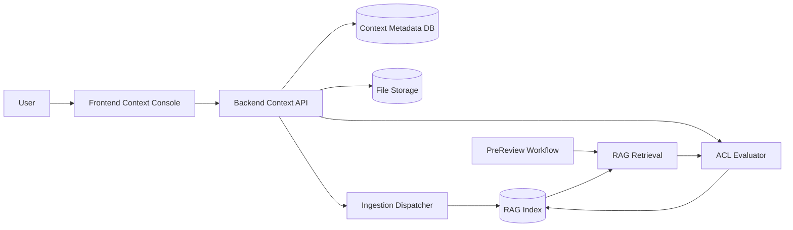

# 总体技术设计方案 - context_system

> Version: v0.1.0
> Last Updated: 2026-03-13
> Status: Draft

## 1. 背景与目标

当前系统已经具备用户体系与 RAG 基础能力，但“上下文文件”仍缺少独立管理能力：

1. 文件上传入口与可见性策略未产品化。
2. RAG 检索未形成统一的文件级权限治理闭环。
3. 文件下线、重建索引、审计追踪缺少标准流程。

本需求目标是在用户系统和 RAG 系统之上建设“上下文（Context）管理系统”，用于将文件作为可治理的知识资产。

核心目标：

1. 支持用户上传文件并管理文件元数据。
2. 支持文件可见性控制：`仅个人`、`仅团队`、`部分用户`、`所有用户`。
3. 支持文件下线（offline）与恢复，offline 文件不参与在线检索。
4. 将权限过滤前置到 RAG 检索链路，确保“看不见就检不出”。
5. 提供可审计、可回滚、可扩展的实现基础。

## 2. 范围（In/Out）

### 2.1 In Scope

1. 文件元数据模型与 ACL（访问控制）模型。
2. 上传、列表、详情、可见性更新、状态更新、重建索引接口。
3. RAG 检索链路对 ACL 的强制过滤。
4. 前端管理页（列表 + 上传 + 可见性/状态操作）。
5. 审计日志与关键运维指标。

### 2.2 Out of Scope（本期不做）

1. 在线文档编辑/版本差异对比。
2. OCR、图片结构化提取、复杂文档解析管线。
3. 细粒度段落级权限（本期为文件级权限）。
4. 跨组织共享审批流程。

## 3. 总体架构与关键流程

关键流程：

1. 上传流程：用户上传文件 -> 落盘/对象存储 -> 写元数据 -> 创建 ingest 任务 -> 索引构建。
2. 可见性更新流程：更新 visibility policy -> 更新 ACL 映射 -> 后续检索立即生效。
3. 下线流程：更新状态为 `OFFLINE` -> 检索路径立即过滤 -> 异步处理索引清理/冻结。
4. 预审检索流程：RAG 收到 query + actor context -> ACL 强制过滤 -> 仅返回可访问证据。

## 4. 数据与状态模型

### 4.1 核心实体

1. `context_files`
- 文件主记录：归属、可见性、状态、存储位置、摘要信息。
2. `context_file_acl_entries`
- 文件 ACL 明细（当可见性为 `SELECTED_USERS` 时生效）。
3. `context_ingestion_jobs`
- 文件入库/重建索引任务状态与结果。
4. `context_file_events`
- 审计事件（上传、可见性变更、下线、恢复、重建等）。

### 4.2 枚举定义

1. `visibility_scope`
- `PRIVATE_SELF`：仅上传者本人可见。
- `TEAM_ONLY`：上传者所在组织全部激活成员可见。
- `SELECTED_USERS`：仅上传者指定成员可见。
- `ALL_USERS`：平台内全部激活用户可见（高风险策略，受权限控制）。

2. `file_status`
- `ACTIVE`：可被检索/可被消费。
- `OFFLINE`：不可检索，但保留元数据。

3. `ingestion_status`
- `PENDING` | `RUNNING` | `SUCCESS` | `FAILED`。

### 4.3 行为准则

1. 默认拒绝：无 ACL 命中时，不返回文件内容。
2. 先鉴权后检索：检索参数必须注入 actor（user/member/org/role）。
3. 下线优先：`OFFLINE` 文件在任何检索场景均不可返回。

## 5. 阶段规划（Phase 1..N）

1. Phase 1：文件模型与 API 基础层
- 元数据表、ACL 表、上传/列表/详情/可见性/状态接口。

2. Phase 2：RAG ACL 集成
- 检索过滤与 offline 生效、重建索引接口与任务跟踪。

3. Phase 3：前端管理控制台
- 文件管理页面、上传流程、策略配置 UI、状态提示与错误处理。

4. Phase 4：可观测性与运维增强
- 审计日志查询、失败任务重试、指标看板字段沉淀。

## 6. 风险与回滚策略

1. 权限泄露风险：ACL 过滤缺失会导致跨用户数据暴露。
- 策略：服务端强制过滤 + DB 层过滤条件 + 结果后置校验。

2. 可见性配置复杂导致误操作。
- 策略：前端明确提示影响范围，后端严格校验 `SELECTED_USERS` 参数合法性。

3. 下线后仍可检索命中（索引延迟）。
- 策略：检索时优先过滤 `file_status`，索引层延迟清理仅作优化。

4. `ALL_USERS` 策略滥用。
- 策略：仅 admin/owner 可设置；默认禁用并受系统配置开关控制。

5. 性能风险（ACL 条件导致检索变慢）。
- 策略：索引字段与 ACL 表联合索引、缓存常用策略、分页查询。

## 7. 需求台账（TD-*)

| TD-ID | 需求描述 | Owner(FE/BE/BOTH) | Priority | 备注 |
|---|---|---|---|---|
| TD-001 | 建立上下文文件元数据模型（含状态、可见性、归属） | BE | P0 | 数据基础 |
| TD-002 | 支持文件上传并触发 ingest 任务 | BOTH | P0 | FE 入口 + BE 接口 |
| TD-003 | 支持文件列表与详情查询 | BOTH | P0 | 管理页核心能力 |
| TD-004 | 支持可见性配置四种策略 | BOTH | P0 | `PRIVATE_SELF/TEAM_ONLY/SELECTED_USERS/ALL_USERS` |
| TD-005 | 支持文件下线/恢复，并影响检索可见性 | BOTH | P0 | 下线立即生效 |
| TD-006 | 检索链路必须执行 ACL 过滤 | BE | P0 | 安全关键 |
| TD-007 | 支持指定用户可见策略的成员候选检索 | BOTH | P1 | 前端联想选择成员 |
| TD-008 | 支持单文件重建索引与任务状态追踪 | BOTH | P1 | 运维与修复能力 |
| TD-009 | 提供审计事件记录（可见性/状态变更） | BE | P1 | 合规与追踪 |
| TD-010 | 前端提供策略影响范围提示与确认机制 | FE | P1 | 降低误操作 |
| TD-011 | 错误码体系覆盖权限、状态冲突、任务失败场景 | BOTH | P1 | 契约稳定性 |
| TD-012 | 预留未来文档内容管理扩展点（版本、段落级权限） | BOTH | P2 | 本期不实现 |

## 8. 风险-缓解-实现映射

| Risk-ID | 风险描述 | 缓解策略 | 技术实现（模块/接口/数据） | 验收项 |
|---|---|---|---|---|
| R-001 | ACL 缺失导致数据越权 | 服务端强制过滤 + 默认拒绝 | `rag/retrieval` 注入 actor filter；`context_file_acl_entries` | AC-BE-004, AC-E2E-002 |
| R-002 | 用户误设为 `ALL_USERS` | 提升权限门槛 + UI 二次确认 | `PATCH /api/context/files/{fileId}/visibility` 权限校验；FE 确认弹窗 | AC-FE-004, AC-BE-006 |
| R-003 | 下线后仍被检索 | 检索阶段强制过滤状态 | 查询条件包含 `file_status=ACTIVE` | AC-BE-005, AC-E2E-003 |
| R-004 | ingest 失败无法恢复 | 提供重建与任务可视 | `POST /api/context/files/{fileId}/reindex` + jobs 表 | AC-BE-007, AC-E2E-004 |
| R-005 | 契约漂移导致联调失败 | FE/BE 合同同源维护 | `04/05` 对齐与一致性检查脚本 | AC-E2E-001 |
