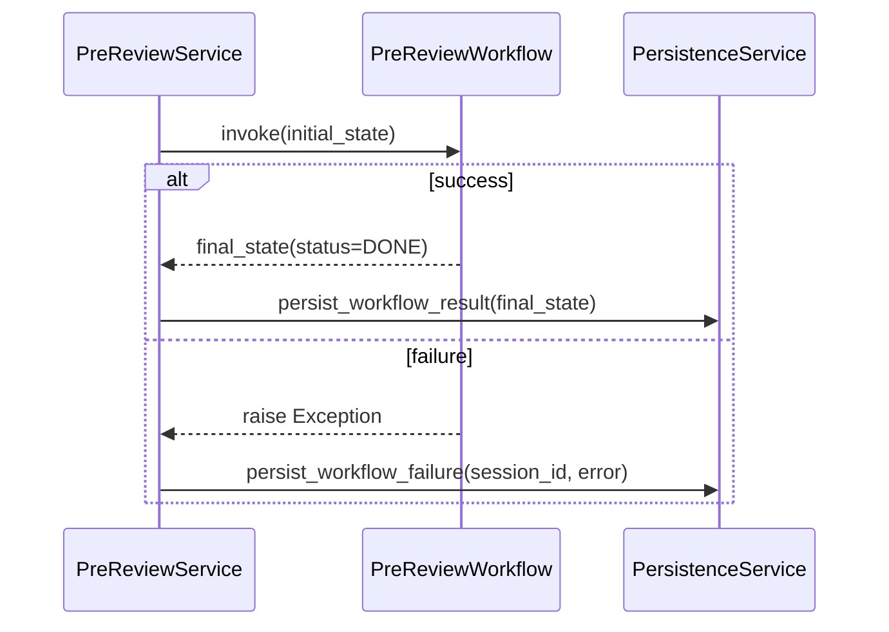

# 核心 Agent 编排器（PreReview Orchestrator）
> Version: v0.1.0
> Last Updated: 2026-03-12
> Status: Active

本文聚焦后端核心：`backend/app/workflow/graph.py` 与相关节点实现。

---

## 1. 编排器角色定位

`PreReviewWorkflow` 是系统主价值链路的执行内核，负责把一次预审请求从“原始输入”推进到“结构化报告输出”，并通过 `PersistenceNode` 完成流程闭环状态。

编排器由 `PreReviewService` 调用：

- `create_prereview`：新建 session 后执行
- `regenerate_prereview`：子版本 session 后执行

---

## 2. 状态模型（PreReviewState）

定义位置：`backend/app/workflow/state.py`

```python
class PreReviewState(TypedDict):
    session_id: str
    parent_session_id: str | None
    request_id: str
    version: int
    normalized_request: dict
    parsed_requirement: dict
    retrieval_plan: dict
    retrieved_candidates: list
    evidence_pack: list
    capability_judgement: dict
    missing_info_items: list
    risk_items: list
    impact_items: list
    report: dict
    status: str
    error_message: str | None
```

关键字段解释：

1. `normalized_request`：输入归一化文本与上下文（含附件文本并入）。
2. `parsed_requirement`：结构化需求草案。
3. `retrieval_plan`：检索计划（query/filter/module tags）。
4. `retrieved_candidates`：候选证据池。
5. `evidence_pack`：最终证据（top8）。
6. `capability_judgement`：能力判断和置信度。
7. `report`：最终输出报告。

---

## 3. 节点拓扑

```mermaid
flowchart LR
    A[input_normalizer]
    B[requirement_parser]
    C[retrieval_planner]
    D[knowledge_retriever]
    E[evidence_selector]
    F[capability_judge]
    G[missing_info_analyzer]
    H[risk_analyzer]
    I[impact_analyzer]
    J[report_composer]
    K[persistence_node]

    A --> B --> C --> D --> E --> F --> G --> H --> I --> J --> K
```



说明：

1. 当前是固定线性流程，无分支路由。
2. `PersistenceNode` 仅回写 `status=DONE`；真正 DB 持久化在 Service 调用后执行。

---

## 4. 节点详细 I/O 与逻辑

## 4.1 InputNormalizerNode

输入来源：`state.normalized_request`

输出：更新后的 `normalized_request`

关键逻辑：

1. 清洗 `requirement_text/background_text/additional_context/attachment_text`。
2. 按顺序拼接到 `merged_text`：
- 需求正文
- 背景
- 补充信息
- 附件信息
3. 根据 `normalized_text_limit` 截断。

---

## 4.2 RequirementParserNode

调用：`model_client.structured_invoke(prompt_name="requirement_parser", schema=RequirementSchema)`

输出 schema：

- `goal`
- `actors`
- `business_objects`
- `data_objects`
- `constraints`
- `expected_output`
- `uncertain_points`

---

## 4.3 RetrievalPlannerNode

调用：`prompt_name="retrieval_planner"`, `schema=RetrievalPlanSchema`

输入参数：

1. `requirement_text`
2. `parsed_requirement`
3. `business_domain`
4. `module_hint`

输出：

1. `queries`
2. `source_filters`
3. `module_tags`

---

## 4.4 KnowledgeRetrieverNode

依赖：`HybridSearcher`

输入：`retrieval_plan`

输出：`retrieved_candidates`

检索流程：

1. FTS（词法重叠）Top20
2. 向量相似 Top20
3. 合并去重（chunk_id）
4. 全局 rerank

---

## 4.5 EvidenceSelectorNode

输入：`retrieved_candidates`

输出：`evidence_pack`

规则：

1. 调用 `model_client.rerank(query, snippets)`
2. 取排序后 top8
3. 使用 `EvidenceItemSchema` 校验结构

---

## 4.6 CapabilityJudgeNode（关键门禁）

输入：`uncertain_points + evidence_pack`

输出：`capability_judgement`

逻辑分两层：

1. 先由 ModelClient 生成初判。
2. 再执行门禁规则：
- 若初判为 `SUPPORTED`，但高质量证据数 `<1`，强制降级。
- 高质量证据定义：`trust_level=HIGH && relevance_score>=0.75`。

这是当前“可解释性与保守性”最关键的质量控制点。

---

## 4.7 MissingInfoAnalyzerNode

输入：`parsed_requirement + merged_text`

输出：`missing_info_items`

每项结构：

- `type`
- `question`
- `priority`（HIGH/MEDIUM/LOW）

---

## 4.8 RiskAnalyzerNode（降级节点）

输入：`merged_text`

输出：`risk_items`

降级策略：

1. 正常：结构化输出并记录 `node_completed` 日志。
2. 异常：记录 `node_degraded`，返回 `risk_items=[]`。

---

## 4.9 ImpactAnalyzerNode（降级节点）

输入：`parsed_requirement + module_hint`

输出：`impact_items`

额外处理：

1. 对同一 `module` 的多条 reason 去重并合并。

降级策略与 Risk 节点一致：异常时返回空列表。

---

## 4.10 ReportComposerNode

输入：

1. `parsed_requirement`
2. `capability_judgement`
3. `evidence_pack`
4. `missing_info_items`
5. `risk_items`
6. `impact_items`

输出：`report`（`ReportSchema`）

包含字段：

- `summary`
- `capabilityJudgement`
- `structuredDraft`
- `evidence`
- `missingInfoItems`
- `riskItems`
- `impactItems`
- `nextSteps`

---

## 4.11 PersistenceNode

行为：返回 `{"status": "DONE"}`。

说明：

- 不直接写数据库。
- 真正持久化在 `PreReviewService` 中调用 `PersistenceService.persist_workflow_result()` 完成。

---

## 5. 与 Service 层的协同



`PreReviewService` 承担：

1. 初始状态组装。
2. 异常捕获和错误码日志。
3. 工作流后置持久化。

---

## 6. ModelClient 现状与扩展点

工厂：`model_client/factory.py`

当前实现：`HeuristicModelClient`

能力：

1. `structured_invoke`：按 `prompt_name` 返回确定性结构。
2. `embed_texts`：hash-bag 向量。
3. `rerank`：词法重叠 + cosine 混合评分。

扩展方式：

1. 保持 `ModelClient` 协议不变。
2. 在 factory 中切换到云模型客户端实现。
3. 节点层可不改或仅最小改动。

---

## 7. 当前局限与后续建议

1. 工作流无并行节点，整体时延取决于串行链路。
2. 附件解析能力仍偏弱（仅 txt/md）。
3. ReportComposer 仍主要依赖 heuristics，语义质量上限受限。
4. 可考虑后续引入：
- 节点级超时与熔断
- 节点并行化（风险/影响）
- 可观测链路追踪（request_id/session_id 全链路）
