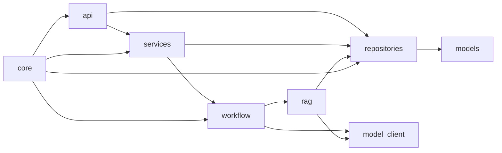

# 后端架构与模块关系
> Version: v0.1.0
> Last Updated: 2026-03-12
> Status: Active

## 1. 技术栈与目录结构

- 框架：FastAPI
- 编排：LangGraph
- ORM：SQLAlchemy
- 配置：Pydantic Settings
- 默认模型能力：HeuristicModelClient（本地可复现）

核心目录：

```text
backend/app/
  api/           # HTTP 路由层
  core/          # 配置、鉴权、数据库、日志
  models/        # SQLAlchemy 数据模型
  repositories/  # 数据访问层
  services/      # 应用服务层
  workflow/      # PreReview 工作流与节点
  rag/           # 检索与知识初始化
  model_client/  # 模型能力接口与实现
  schemas/       # 节点结构化输出 schema
  main.py        # 应用入口
```

---

## 2. 分层职责

| 层 | 代表文件 | 主要职责 | 不负责 |
|---|---|---|---|
| API 层 | `api/*.py` | 请求参数解析、鉴权依赖、异常到 HTTP 错误映射 | 业务编排、数据库细节 |
| Service 层 | `services/*.py` | 用例编排（create/get/regenerate/history/upload） | SQL 细节、前端渲染 |
| Workflow 层 | `workflow/graph.py` + `nodes/*` | Agent 节点编排与状态流转 | HTTP/鉴权、数据库事务控制 |
| Repository 层 | `repositories/prereview_repository.py` | 数据持久化查询与更新 | 业务策略判断 |
| Model 层 | `models/prereview.py` | 表结构定义 | 业务逻辑 |
| ModelClient 层 | `model_client/*` | 结构化生成/向量/重排抽象 | 业务编排 |
| RAG 层 | `rag/search.py` + `rag/bootstrap.py` | 检索、合并重排、内置知识加载 | API 接口 |

---

## 3. 模块依赖方向



约束：

1. API 仅做协议适配，不下沉复杂逻辑。
2. Service 是业务入口，负责串联 repo/workflow。
3. 节点只读写 `PreReviewState`，不直接触碰 HTTP。
4. Repository 集中数据访问，避免 SQL 分散。

---

## 4. 关键运行链路

## 4.1 App 启动

`app/main.py` 在启动事件中做两件事：

1. `Base.metadata.create_all(bind=engine)` 自动建表。
2. `ensure_builtin_knowledge(...)` 若知识库为空则写入种子文档与切片向量。

## 4.2 预审创建

`POST /api/prereview` -> `PreReviewService.create_prereview()`：

1. `create_request`
2. `create_session(version=1)`
3. `merge_attachment_text`
4. `workflow.invoke(initial_state)`
5. `persist_workflow_result`

## 4.3 预审再生成

`POST /api/prereview/{session_id}/regenerate`：

1. 校验 parent session 与 request。
2. 新建子 session（版本 +1，parent 关联）。
3. 携带新增上下文与附件进入同一工作流。
4. 成功后返回新 `sessionId`。

---

## 5. 配置与安全边界

## 5.1 配置

来自 `core/config.py` 的关键项：

1. `api_token`
2. `database_url`
3. `upload_dir`
4. `upload_max_size_mb`
5. `cors_allow_origins`

## 5.2 鉴权

`core/auth.py` 采用简单 Bearer Token：

- Header: `Authorization: Bearer <COPRODUCT_API_TOKEN>`
- 缺失或不匹配统一返回 401 + `AUTH_ERROR`

## 5.3 CORS

`main.py` 读取 `COPRODUCT_CORS_ALLOW_ORIGINS` 并注入 FastAPI CORS middleware。

---

## 6. 错误与降级

1. API 层显式错误码：`AUTH_ERROR`、`VALIDATION_ERROR`、`WORKFLOW_ERROR`、`FILE_UPLOAD_ERROR`、`FILE_PARSE_ERROR`。
2. 降级节点：
- `RiskAnalyzerNode` 异常 -> `risk_items=[]`
- `ImpactAnalyzerNode` 异常 -> `impact_items=[]`
3. 会话级失败：任何未降级异常通过 `persist_workflow_failure` 落库，session 标记 `FAILED`。

---

## 7. 现阶段演进点

1. `model_client/factory.py` 已预留切换云模型入口。
2. `AttachmentService` 已形成状态机，后续可扩展 pdf/docx parser。
3. `HybridSearcher` 当前为本地混合检索流程，可替换为 pgvector / 专用向量库实现。
