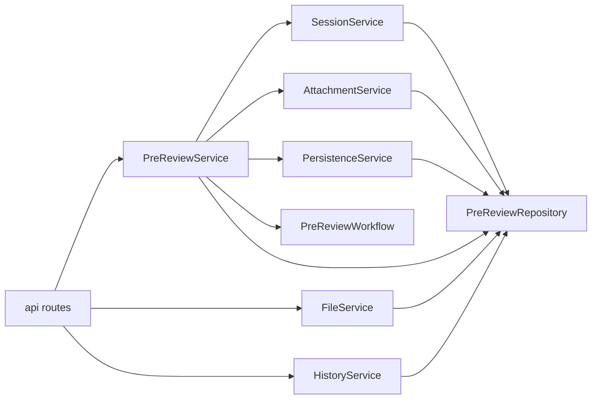

# 后端 Service 层详解
> Version: v0.1.1
> Last Updated: 2026-03-12
> Status: Active

本文专门说明 `backend/app/services/` 当前实现的功能边界与依赖关系。

---

## 1. Service 层定位

Service 层是后端“用例编排层”，职责是：

1. 将 API 请求转换为业务动作。
2. 组织 repository、workflow、附件处理等依赖调用。
3. 统一成功与失败的持久化收口。

不承担：

- SQL 细节（Repository 负责）
- HTTP 协议细节（API 层负责）
- 节点推理细节（Workflow 节点负责）

---

## 2. 依赖关系

---

## 3. Service 模块说明

## 3.1 PreReviewService（核心）

文件：`services/prereview_service.py`

### 关键方法

1. `create_prereview(payload)`
2. `regenerate_prereview(payload)`
3. `get_prereview(session_id)`

### create_prereview 执行步骤

1. 创建 request。
2. 创建 session（`version=1`）。
3. 解析并合并附件文本。
4. 组装 `PreReviewState` 初始值。
5. 调用 workflow。
6. 成功：`persist_workflow_result`。
7. 失败：`persist_workflow_failure` + 日志。

### regenerate_prereview 执行步骤

1. 读取 parent session + request。
2. 创建子 session（版本 +1，parent 关联）。
3. 附件文本并入。
4. 复用同一 workflow 执行。
5. 成功/失败路径与 create 对齐。

---

## 3.2 SessionService

文件：`services/session_service.py`

职责：

1. 封装 session 创建和版本递增规则。
2. 父 session 不存在时抛 `ValueError`。

---

## 3.3 PersistenceService

文件：`services/persistence_service.py`

职责：

1. 将 workflow 输出写入 `reports/evidence_items/sessions`。
2. 将内部数据映射为前端稳定 view model。

关键点：

1. `status` 映射保护（兼容旧状态 `SUCCESS -> DONE`）。
2. `confidence` 缺失时按 evidence 兜底推断。
3. `FAILED` 会话会回填 `errorCode=WORKFLOW_ERROR`。

---

## 3.4 FileService

文件：`services/file_service.py`

职责：

1. 校验文件扩展名和大小。
2. 将文件写入 `upload_dir`。
3. 写入 `uploaded_files` 元数据（初始 `parse_status=PENDING`）。

输出：

- `fileId/fileName/fileSize/parseStatus`

---

## 3.5 AttachmentService

文件：`services/attachment_service.py`

职责：

1. 接收 `attachments.file_id` 列表。
2. 逐个读取文件并解析文本。
3. 管理解析状态流转并记录日志。
4. 返回可并入 `normalized_request` 的文本块。

当前解析支持：

- `txt/md`（成功）
- `pdf/docx`（会走失败降级）

降级策略：

1. 单附件失败不阻断整体流程。
2. `parse_status` 标记 `FAILED`，并记录 `FILE_PARSE_ERROR` 日志。

---

## 3.6 HistoryService

文件：`services/history_service.py`

职责：

1. 调用 repository 的历史查询。
2. 返回前端约定分页结构：`total/page/pageSize/items`。

---

## 4. 错误处理约定（Service 视角）

1. 参数/资源类错误以 `ValueError` 抛出，由 API 层映射到 HTTP。
2. workflow 异常由 PreReviewService 统一捕获并持久化失败状态。
3. 附件解析失败通过降级处理，不将失败直接升级为整单失败。

---

## 5. Service 层可扩展建议

1. 将 PreReviewService 初始状态构建拆分为 Builder，减少单类复杂度。
2. 引入事务边界装饰器，统一 commit/rollback 策略。
3. 增加 Service 层单元测试覆盖 create/regenerate 全流程（含异常分支）。
