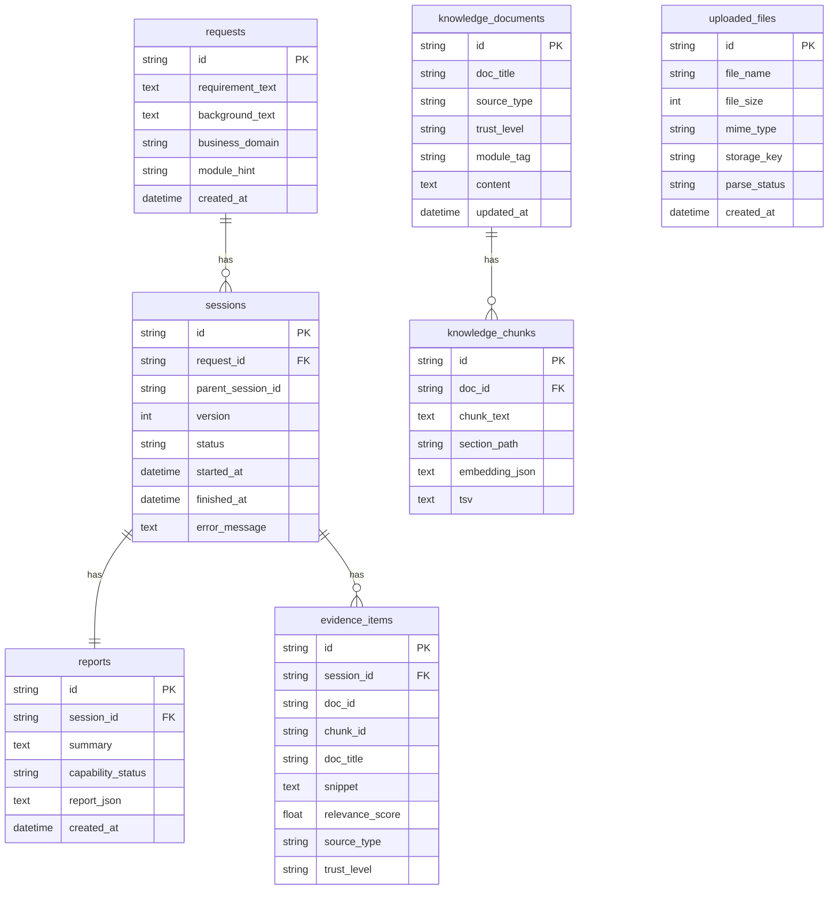
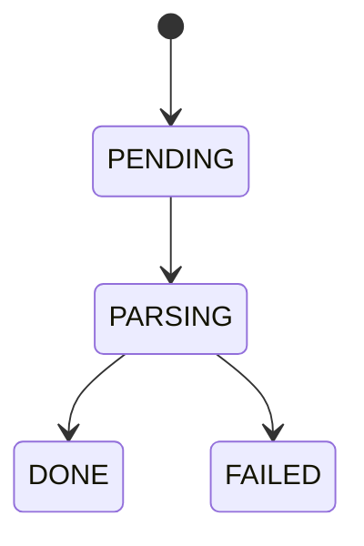

# 数据模型与持久化设计
> Version: v0.1.1
> Last Updated: 2026-03-12
> Status: Active

## 1. 数据存储概览

当前系统使用 SQLAlchemy ORM，数据可落地到：

1. PostgreSQL（默认配置）
2. SQLite（本地开发常用）

文件本体存储在本地目录（`COPRODUCT_UPLOAD_DIR`），数据库保存文件元数据与状态。

---

## 2. 表结构与关系

主要模型定义在 `backend/app/models/prereview.py`。

补充约束说明（Mermaid 图中未完全表达）：

1. `reports.session_id` 在数据库中是唯一约束（一个 session 对应一份 report）。
2. `sessions.request_id`、`sessions.parent_session_id`、`evidence_items.session_id` 有索引。

---

## 3. 表字段含义与作用

## 3.1 `requests`

| 字段 | 类型 | 作用 |
|---|---|---|
| `id` | string | 请求主键（`req_*`） |
| `requirement_text` | text | 用户原始需求正文 |
| `background_text` | text/null | 业务背景补充 |
| `business_domain` | string/null | 业务域提示 |
| `module_hint` | string/null | 模块提示 |
| `created_at` | datetime | 请求创建时间 |

## 3.2 `sessions`

| 字段 | 类型 | 作用 |
|---|---|---|
| `id` | string | 会话主键（`ses_*`） |
| `request_id` | string | 关联 `requests.id` |
| `parent_session_id` | string/null | 再生成时指向父会话 |
| `version` | int | 会话版本号（首次 1，后续 +1） |
| `status` | string | 会话状态（`PROCESSING/DONE/FAILED`） |
| `started_at` | datetime | 执行开始时间 |
| `finished_at` | datetime/null | 执行结束时间 |
| `error_message` | text/null | 失败错误描述 |

## 3.3 `reports`

| 字段 | 类型 | 作用 |
|---|---|---|
| `id` | string | 报告主键（`rep_*`） |
| `session_id` | string | 关联 `sessions.id`（唯一） |
| `summary` | text | 报告摘要 |
| `capability_status` | string | 能力判断主状态，用于历史筛选 |
| `report_json` | text | 完整结构化报告 JSON 字符串 |
| `created_at` | datetime | 报告写入时间 |

## 3.4 `evidence_items`

| 字段 | 类型 | 作用 |
|---|---|---|
| `id` | string | 证据主键（`evi_*`） |
| `session_id` | string | 所属 session |
| `doc_id` | string | 来源知识文档 ID |
| `chunk_id` | string | 来源知识切片 ID |
| `doc_title` | string | 来源文档标题 |
| `snippet` | text | 证据片段文本 |
| `relevance_score` | float | 相关性分值 |
| `source_type` | string | 来源类型（product/api/constraint/case） |
| `trust_level` | string | 可信级别（HIGH/MEDIUM/LOW） |

## 3.5 `uploaded_files`

| 字段 | 类型 | 作用 |
|---|---|---|
| `id` | string | 文件主键（`file_*`） |
| `file_name` | string | 原文件名 |
| `file_size` | int | 文件字节大小 |
| `mime_type` | string | MIME 类型 |
| `storage_key` | string | 文件存储路径 |
| `parse_status` | string | 解析状态（`PENDING/PARSING/DONE/FAILED`） |
| `created_at` | datetime | 上传时间 |

## 3.6 `knowledge_documents`

| 字段 | 类型 | 作用 |
|---|---|---|
| `id` | string | 知识文档主键（`kdoc_*`） |
| `doc_title` | string | 文档标题 |
| `source_type` | string | 文档类型 |
| `trust_level` | string | 文档可信度 |
| `module_tag` | string/null | 模块标签（过滤用） |
| `content` | text | 文档全文 |
| `updated_at` | datetime | 更新时间 |

## 3.7 `knowledge_chunks`

| 字段 | 类型 | 作用 |
|---|---|---|
| `id` | string | 知识切片主键（`kchk_*`） |
| `doc_id` | string | 关联 `knowledge_documents.id` |
| `chunk_text` | text | 切片文本 |
| `section_path` | string/null | 切片来源位置 |
| `embedding_json` | text/null | 向量 JSON |
| `tsv` | text/null | 预留全文检索文本 |

---

## 4. 业务对象关系与版本链

## 4.1 请求与会话

1. `requests` 代表一次输入语义，不随 regenerate 改变。
2. `sessions` 代表该请求下的一次执行实例，按版本链递增。

版本链规则：

- 首次创建：`version=1`, `parent_session_id=null`
- 再生成：`version=parent.version+1`, `parent_session_id=parent.id`

## 4.2 报告与证据

1. `reports.report_json` 保存完整报告，作为前端详情主来源。
2. `evidence_items` 为可追溯证据快照，支持统计与追查。

## 4.3 附件状态机

说明：

1. `PENDING`：上传完成，尚未解析。
2. `PARSING`：服务正在解析内容。
3. `DONE`：解析成功，可并入 `merged_text`。
4. `FAILED`：解析失败，允许降级继续主流程。

---

## 5. Repository 访问模式

实现：`PreReviewRepository`

## 5.1 写入方法

1. `create_request(...)`
2. `create_session(...)`
3. `update_session_status(...)`
4. `upsert_report(...)`
5. `replace_evidence_items(...)`
6. `create_uploaded_file(...)`
7. `update_uploaded_file_parse_status(...)`

## 5.2 查询方法

1. `get_request/get_session/get_report`
2. `list_evidence`
3. `get_uploaded_file`
4. `list_history(keyword, capability_status, page, page_size)`

`list_history` 特点：

1. 联表 `sessions + requests + reports`
2. 支持关键字与能力状态过滤
3. 默认按 `started_at DESC` 排序

---

## 6. 持久化服务（PersistenceService）

职责：连接 workflow 输出与数据库模型。

## 6.1 成功路径

`persist_workflow_result(state)` 做三件事：

1. upsert 报告
2. 替换证据
3. 更新 session 状态

## 6.2 失败路径

`persist_workflow_failure(session_id, error_message)`：

1. session 标记 `FAILED`
2. 写入 `error_message`

## 6.3 读模型映射

`get_session_result(session_id)` 将 DB 数据映射为前端契约字段：

1. `structuredDraft.business_objects` -> `structuredRequirement.scope`
2. `riskItems.type/description/level` -> `risks.title/description/level`
3. `impactItems` -> `impactScope` 文本列表
4. `evidenceCount` 来自 `evidence_items` 实际条数

---

## 7. 知识库数据与检索对象

## 7.1 启动种子

`rag/bootstrap.py` 在知识为空时自动写入内置文档：

1. 导出 API 说明
2. 权限规范
3. 报名业务说明

## 7.2 切片与向量

1. 文档先切片（`chunk_document`）
2. 再由 ModelClient 生成 embedding
3. 存入 `knowledge_chunks.embedding_json`

---

## 8. 当前数据层限制

1. 未引入迁移工具（如 Alembic），以 `create_all` 自动建表为主。
2. `uploaded_files` 未保存解析文本正文，仅保留状态与文件路径。
3. 历史查询是页码分页，未做 cursor 分页。
4. `report_json` 为文本列，深层字段聚合分析成本较高。
