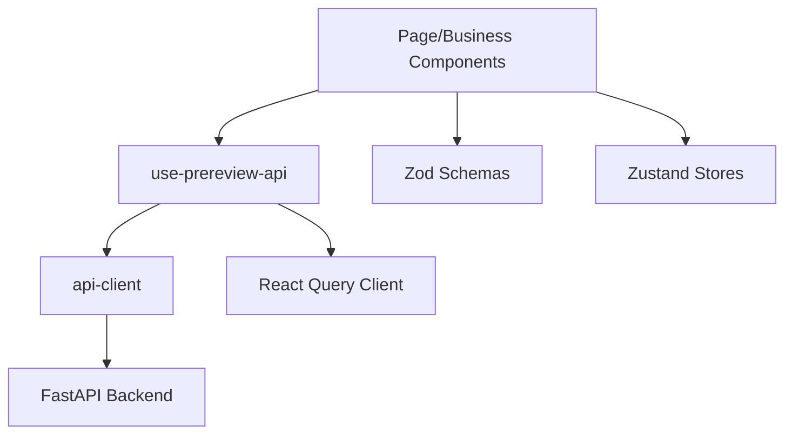

# 前端架构与交互链路
> Version: v0.1.0
> Last Updated: 2026-03-12
> Status: Active

## 1. 技术栈与结构

- 框架：Next.js 15（App Router）
- 语言：TypeScript
- 样式：Tailwind CSS
- 数据层：React Query
- 表单：React Hook Form + Zod
- 局部状态：Zustand

核心目录：

```text
frontend/src/
  app/                  # 路由页、layout、error
  components/base/      # 通用 UI 组件
  components/business/  # 业务展示组件
  components/layout/    # 页面壳组件（含全局导航）
  features/             # 页面级编排逻辑
  hooks/                # API hooks
  lib/                  # api-client/query-client/constants/utils
  schemas/              # 表单校验 schema
  stores/               # 本地草稿/局部 UI 状态
  types/                # 前端契约类型
```

---

## 2. 页面与导航（M3.1）

当前页面：

1. `/`：统一入口 Dashboard
2. `/prereview/new`：新建预审
3. `/prereview/[sessionId]`：预审详情
4. `/history`：历史列表
5. `/review/*`：兼容重定向到 `/prereview/*`

全局导航壳：`components/layout/app-shell.tsx`

- 顶部固定入口：`首页` / `新建预审` / `历史记录`
- 当前路由高亮

---

## 3. 前端模块职责

## 3.1 app 层

1. 定义页面路由与 layout。
2. 装配 `Providers`（React Query）。
3. 提供 `app/error.tsx` 页面级兜底。

## 3.2 features 层

1. `create-review/*`：表单提交链路。
2. `review-detail/*`：详情查询、轮询、再生成。
3. `history/*`：筛选 + 分页 + 跳转。
4. `home/*`：入口页快捷跳转 + 最近会话。

## 3.3 lib/api-client.ts

统一处理：

1. 请求封装（含 Bearer Token）
2. 超时控制（15s）
3. 错误码映射（如 `FILE_PARSE_ERROR`）
4. 响应归一化（状态、枚举、字段兜底）

---

## 4. 数据流与依赖关系



关键原则：

1. 组件不直接 `fetch`。
2. 所有接口契约走 `types + api-client normalize`。
3. 页面状态（loading/error/empty）由 feature 层统一呈现。

---

## 5. 关键交互链路

## 5.1 新建预审

`CreateReviewForm`：

1. 表单校验（`createReviewSchema`）
2. 可上传附件（`FileUploader`）
3. 提交调用 `useCreatePrereview`
4. 成功跳转 `/prereview/{sessionId}`

额外能力：

- LocalStorage 草稿保存（`DRAFT_KEY`）
- 示例输入一键填充

## 5.2 结果页查询与轮询

`usePrereviewDetail(sessionId)`：

1. 请求详情
2. 若状态是 `PROCESSING`，每 2 秒轮询
3. 状态变 `DONE/FAILED` 自动停止
4. 404 映射为 `NOT_FOUND` 页面语义

## 5.3 再生成

`RegeneratePanel`：

1. `regenerateSchema` 校验：补充信息和附件不能同时为空
2. 支持追加附件上传
3. 调用 `useRegeneratePrereview`
4. 成功后跳新 session

## 5.4 历史查询

`HistoryView`：

1. 支持关键字 + 能力状态筛选
2. 分页边界：`page>=1`、`pageSize<=100`
3. 点击记录跳详情

## 5.5 附件上传

`FileUploader`：

1. 前置校验：扩展名、总文件数、总大小
2. 显示 `parseStatus`（PENDING/PARSING/DONE/FAILED）
3. 失败可删除重传

---

## 6. 类型与校验策略

## 6.1 类型定义（types）

关键类型：

1. `PreReviewReportView`
2. `UploadedFileRef`
3. `HistoryListResponse`

## 6.2 校验（schemas）

1. `createReviewSchema`：需求文本长度、附件结构和数量。
2. `regenerateSchema`：限制“空输入无附件”的无效再生成。

---

## 7. 错误处理与稳定性

1. `api-client` 将后端错误码映射为用户可读文案。
2. 接口超时返回明确提示（HTTP 408 语义）。
3. 页面级异常由 `app/error.tsx` 兜底，避免白屏。
4. React Query 重试策略按接口场景细化（如 404 不重试）。

---

## 8. 当前前端限制与后续演进

1. 尚未引入端到端测试（如 Playwright）。
2. 历史列表未做虚拟滚动。
3. 前端暂未展示“节点级运行轨迹”，仅展示最终报告。
4. 后续可增加：
- 版本树可视化
- 附件解析进度轮询
- 页面级埋点与性能监控
