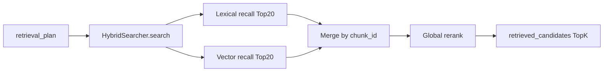

Title: RAG Retrieval Module
Version: v1.0.0
Last Updated: 2026-03-13
Scope: 检索增强（知识初始化、混合检索、证据候选输出）
Audience: AI engineers, backend engineers, maintainers

# RAG Retrieval Module

## Module Goal and Value

RAG 模块为预审流程提供“可追溯证据候选池”：

1. 从知识库中检索与需求相关的文档片段。
2. 将候选证据标准化为统一结构，供后续节点判定与报告生成。
3. 在无外部依赖场景下保持本地可复现。

## Boundaries and Dependencies

边界内：

1. `rag/search.py`：HybridSearcher 和 chunk 工具。
2. `rag/bootstrap.py`：内置知识初始化。
3. `models`：`knowledge_documents`, `knowledge_chunks`。

边界外：

1. 最终能力结论判断（由 `CapabilityJudgeNode` 决定）。
2. 前端展示层。

关键依赖：

1. `ModelClient`：embedding 与 rerank。
2. SQLAlchemy session：读取知识 chunk/doc。
3. workflow 节点 `KnowledgeRetrieverNode`：作为检索入口。

## Core Flow (Mermaid)

### Diagram Notes

1. 每条 query 会生成词法与向量两路候选，再跨 query 合并去重。
2. 合并后会再次全局重排，减少单路召回偏差。

## API Design

> 该模块无直接 HTTP endpoint；这里的 API 指“内部函数契约”。

### Endpoint / Function List

| Function | Purpose |
|---|---|
| `HybridSearcher.search(...)` | 执行混合检索并返回标准候选 |
| `HybridSearcher._search_single(...)` | 单 query 的双路召回 |
| `ensure_builtin_knowledge(...)` | 初始化内置知识文档与 chunks |
| `chunk_document(...)` | 文档切片 |

### Authentication and Authorization

1. RAG 模块不直接处理用户鉴权。
2. 组织范围隔离由上层业务层控制（当前知识库为全局内置语料）。

### Request Schema and Validation

#### `HybridSearcher.search`

| Param | Type | Validation | Meaning |
|---|---|---|---|
| `queries` | `list[str]` | 过滤空字符串 | 检索查询集合 |
| `source_filters` | `dict` | 可空 | 过滤条件（当前使用 `module_hint`） |
| `module_tags` | `list[str]` | 可空 | 预留标签过滤 |
| `top_k` | `int` | 默认 20 | 输出最大条数 |

#### `ensure_builtin_knowledge`

| Param | Meaning |
|---|---|
| `session_factory` | DB session 构造器 |
| `model_client` | embedding 生成器 |

触发条件：`knowledge_chunks` 为空时才执行初始化。

### Response Schema and Field Semantics

`HybridSearcher.search` 返回项字段：

| Field | Meaning |
|---|---|
| `doc_id` | 知识文档 ID |
| `doc_title` | 文档标题 |
| `chunk_id` | 片段 ID |
| `snippet` | 文本片段内容 |
| `source_type` | 来源类型（`product_doc/api_doc/constraint_doc/case`） |
| `relevance_score` | 相关性分值（浮点） |
| `trust_level` | 可信级别（`HIGH/MEDIUM/LOW`） |
| `retrieval_stage` | 来源阶段（`fts` 或 `vector`） |

### Error Model and Status Mapping

RAG 内部函数不直接返回 HTTP 错误；错误处理由上层节点/服务决定：

1. 检索失败或候选为空时，工作流继续执行，后续节点按空候选处理。
2. 风险影响评估失败在节点层降级为 `[]`，避免流程中断。

## Data Model

### Entity List

1. `knowledge_documents`
2. `knowledge_chunks`

### Field Meaning and Constraints

#### `knowledge_documents`

| Field | Meaning |
|---|---|
| `doc_title` | 文档标题 |
| `source_type` | 文档来源类型 |
| `trust_level` | 文档可信级别 |
| `module_tag` | 模块标签过滤字段 |
| `content` | 原始文档内容 |

#### `knowledge_chunks`

| Field | Meaning |
|---|---|
| `doc_id` | 所属知识文档 |
| `chunk_text` | 切片文本 |
| `section_path` | 文档内部位置标记 |
| `embedding_json` | 向量数据（JSON array） |
| `tsv` | 词法检索辅助文本 |

### Index / Uniqueness and Relation Notes

1. `knowledge_chunks.doc_id` 外键到 `knowledge_documents.id`。
2. 删除文档会级联删除其 chunks。
3. `knowledge_documents.module_tag` 带索引，可做模块过滤。

### State / Lifecycle Transitions

1. 初始空库 -> `ensure_builtin_knowledge` 写入内置文档与 chunk。
2. 查询阶段只读，不修改知识数据。
3. 当前无在线更新流程（新增文档需后续扩展实现）。

### Retention and Archival

1. 当前知识库长期保留，不做自动归档。
2. 若后续接入外部知识源，需新增版本管理与失效策略。

## Failure and Fallback

1. `embedding_json` 缺失时，searcher 会临时调用 `model_client.embed_texts` 生成向量。
2. tokenization 和 cosine 计算均为容错实现，避免异常中断。
3. 上层工作流可在证据不足时自动降级结论，防止误判“SUPPORTED”。

## Extension Points

1. 可替换为 PostgreSQL FTS / pgvector / 外部向量检索服务。
2. 可扩展 source filters（组织、版本、文档生效期等）。
3. 可新增知识导入 API、增量 embedding、离线评测基准。
4. 可增加检索指标（空命中率、重复率、TopK 命中率）并接入监控。
