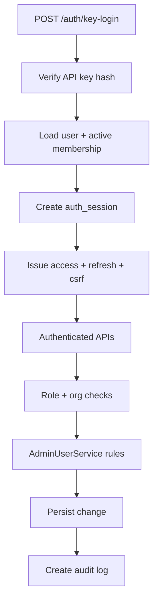

Title: User Management and Auth Module
Version: v1.0.0
Last Updated: 2026-03-13
Scope: 用户认证、组织成员治理、API Key 与审计能力
Audience: Backend engineers, frontend engineers, security reviewers

# User Management and Auth Module

## Module Goal and Value

该模块提供系统访问控制与组织治理基线：

1. 用 API Key 完成登录并建立安全会话。
2. 用组织内角色（OWNER/ADMIN/MEMBER/VIEWER）约束操作权限。
3. 提供成员/职能/API key/审计的一体化管理能力。
4. 将治理规则集中在 `AdminUserService`，降低策略散落风险。

## Boundaries and Dependencies

边界内：

1. 认证接口：`/api/auth/*`
2. 管理接口：`/api/admin/*`
3. 规则执行：`services/auth_service.py`, `services/admin_user_service.py`
4. 数据持久化：`repositories/user_repository.py`

边界外：

1. 预审报告计算与检索。
2. 前端页面路由与展示。

关键依赖：

1. `core/auth.py`：请求鉴权依赖与 mode 切换。
2. `core/security.py`：JWT/API key hash/CSRF 工具。
3. `models/user_management.py`：组织治理实体。

## Core Flow (Mermaid)

### Diagram Notes

1. 登录后拿到的是“用户 + 当前组织上下文”的会话，而不是裸 user。
2. 管理操作先过规则校验，再做落库，最后写审计。

## API Design

### Endpoint List

| Method | Path | Purpose |
|---|---|---|
| POST | `/api/auth/key-login` | API Key 登录并签发 access/refresh |
| POST | `/api/auth/refresh` | 轮换 refresh 会话并签发新 access |
| POST | `/api/auth/logout` | 注销当前或全部设备会话 |
| GET | `/api/auth/me` | 查询当前用户信息 |
| GET | `/api/auth/context` | 查询当前 activeOrg 与 availableOrgs |
| GET | `/api/admin/users` | 列表查询组织内用户 |
| POST | `/api/admin/users` | 创建用户并加入当前组织 |
| PATCH | `/api/admin/users/{user_id}/status` | 更新账号状态 |
| PATCH | `/api/admin/users/{user_id}/role` | 更新组织权限角色 |
| GET | `/api/admin/members` | 列表查询成员（含职能） |
| PATCH | `/api/admin/members/{member_id}/role` | 更新成员权限角色 |
| PATCH | `/api/admin/members/{member_id}/status` | 更新成员状态 |
| PATCH | `/api/admin/members/{member_id}/functional-role` | 更新成员职能角色 |
| GET | `/api/admin/functional-roles` | 查询组织职能角色字典 |
| POST | `/api/admin/functional-roles` | 创建职能角色 |
| PATCH | `/api/admin/functional-roles/{role_id}/status` | 启停职能角色 |
| GET | `/api/admin/member-options` | 成员联想检索（签发 key 场景） |
| GET | `/api/admin/api-keys` | 查询 API keys |
| POST | `/api/admin/api-keys` | 签发 API key |
| POST | `/api/admin/api-keys/{key_id}/revoke` | 吊销 API key 并联动会话 |
| GET | `/api/admin/audit-logs` | 查询审计日志 |

### Authentication and Authorization

1. `/api/auth/key-login` 与 `/api/auth/refresh` 不要求 Bearer access token。
2. 其他 auth/admin 接口均要求 Bearer access token。
3. `/api/admin/*` 统一要求 `OWNER` 或 `ADMIN`。
4. 管理接口内部还会做目标成员权限边界检查（例如 ADMIN 不能操作 OWNER）。

### Request Schema and Validation

#### Auth

| Endpoint | Field | Type | Validation | Meaning |
|---|---|---|---|---|
| key-login | `apiKey` | string | `min=20,max=128,prefix=cpk_` | 登录凭据 |
| key-login | `deviceInfo` | string? | `max=255` | 设备描述，写入审计/会话 |
| refresh | header `X-CSRF-Token` | string | 必填且与 csrf cookie/JWT claim 一致 | 防 CSRF |
| logout | `allDevices` | bool | 可选，默认 false | 是否吊销当前用户当前组织下所有会话 |

#### Admin Users/Members

| Endpoint | Key Field | Validation | Meaning |
|---|---|---|---|
| create user | `email` | 必须含 `@` | 用户唯一标识邮箱 |
| create user | `role` | 必须在 `OWNER/ADMIN/MEMBER/VIEWER` | 组织权限角色 |
| update user status | `status` | `ACTIVE/DISABLED/PENDING_INVITE` | 账号状态 |
| update member status | `status` | `INVITED/ACTIVE/SUSPENDED/REMOVED` | 组织成员状态 |
| update member functional role | `functionalRoleId` | 必须属于当前组织且激活 | 成员职能角色 |

#### Admin API Keys

| Endpoint | Field | Validation | Meaning |
|---|---|---|---|
| issue api key | `userId` | 必填 | 目标用户 |
| issue api key | `name` | 非空 | 密钥用途名称 |
| issue api key | `orgId` | 可选；若传入必须等于 active org | 目标组织上下文 |
| member-options | `query` | 最小 2 字符 | 成员邮箱/显示名前缀搜索 |
| member-options | `limit` | `1~50` | 最大候选返回数 |

### Response Schema and Field Semantics

#### Login Response (`POST /api/auth/key-login`)

| Field | Meaning |
|---|---|
| `accessToken` | 用于 Bearer 鉴权的短期 token |
| `tokenType` | 固定 `Bearer` |
| `expiresIn` | access token 秒级过期时长 |
| `user.id` | 当前登录 user id |
| `user.role` | 当前 active org 下的权限角色 |
| `user.orgId` | 当前会话组织 |

#### Auth Context (`GET /api/auth/context`)

| Field | Meaning |
|---|---|
| `activeOrg` | 当前会话绑定组织 |
| `availableOrgs` | 用户可用组织列表 |
| `scopeMode` | 当前上下文模式（目前返回 `ORG_SCOPED`） |

#### Admin List Responses

统一分页字段：`items`, `total`, `page`, `pageSize`。

关键业务字段：

1. member 列表含 `permissionRole/memberStatus/functionalRole*`。
2. api key 列表含 `status/expiresAt/lastUsedAt/userEmail/userDisplayName`。
3. audit 列表含 `action/result/meta/createdAt`。

### Error Model and Status Mapping

| Error Code | Typical HTTP Status | Trigger |
|---|---|---|
| `AUTH_ERROR` | 401 | key/token 缺失或无效 |
| `TOKEN_EXPIRED` | 401 | access/refresh 过期或 session 失效 |
| `PERMISSION_DENIED` | 403 | 角色无权限或跨组织操作 |
| `OWNER_GUARD_VIOLATION` | 403 | ADMIN 操作 OWNER |
| `SELF_OPERATION_FORBIDDEN` | 403 | 自降权/自禁用/自吊销 key |
| `NO_ACTIVE_ORG` | 403 | 无 active org 上下文 |
| `LAST_OWNER_PROTECTED` | 409 | 组织最后一个 ACTIVE OWNER 被移除 |
| `RESOURCE_NOT_FOUND` | 404 | user/member/key/role 不存在 |
| `VALIDATION_ERROR` | 422/409 | 入参不合法或冲突 |
| `FUNCTION_ROLE_MISMATCH` | 422 | 职能角色不属于当前组织 |
| `PERSISTENCE_ERROR` | 500 | 落库失败 |

## Data Model

### Entity List

1. `organizations`
2. `users`
3. `memberships`
4. `org_function_roles`
5. `api_keys`
6. `auth_sessions`
7. `audit_logs`

### Field Meaning and Constraints

#### `users`

| Field | Meaning | Constraint |
|---|---|---|
| `id` | 用户唯一标识 | PK |
| `email` | 登录与识别邮箱 | unique + indexed |
| `status` | 账号状态 | ACTIVE/DISABLED/PENDING_INVITE |
| `last_login_at` | 最近登录时间 | nullable |

#### `memberships`

| Field | Meaning | Constraint |
|---|---|---|
| `user_id` | 关联 user | FK users |
| `org_id` | 关联组织 | FK organizations |
| `role` | 组织权限角色 | OWNER/ADMIN/MEMBER/VIEWER |
| `status` | 成员状态 | INVITED/ACTIVE/SUSPENDED/REMOVED |
| `functional_role_id` | 组织职能角色 | FK org_function_roles |

唯一约束：`(user_id, org_id)`。

#### `api_keys`

| Field | Meaning | Constraint |
|---|---|---|
| `key_prefix` | 前缀索引字段 | indexed |
| `key_hash` | 密钥哈希 | unique |
| `key_salt` | 哈希盐值 | required |
| `status` | key 状态 | ACTIVE/REVOKED/EXPIRED |
| `expires_at` | 到期时间 | nullable |

#### `auth_sessions`

| Field | Meaning | Constraint |
|---|---|---|
| `id` | 会话 ID（sid） | PK |
| `refresh_token_hash` | refresh token 哈希 | required |
| `status` | 会话状态 | ACTIVE/REVOKED |
| `version` | 轮换版本号 | refresh 成功 +1 |
| `api_key_id` | 来源 key | nullable FK |

#### `audit_logs`

| Field | Meaning |
|---|---|
| `action` | 审计动作类型 |
| `result` | SUCCESS/FAILED |
| `meta_json` | 扩展上下文（原因、联动数量等） |

### Index / Uniqueness and Relation Notes

1. `users.email` 唯一，避免同邮箱重复身份。
2. `memberships(user_id, org_id)` 唯一，确保单组织内唯一成员关系。
3. `api_keys.key_hash` 唯一，保证 key hash 不冲突。
4. `auth_sessions.user_id/org_id/status` 支撑会话批量吊销。

### State / Lifecycle Transitions

1. user: `ACTIVE <-> DISABLED`，创建可为 `PENDING_INVITE`。
2. membership: `INVITED -> ACTIVE -> SUSPENDED/REMOVED`。
3. api key: `ACTIVE -> REVOKED`（到期时视作 EXPIRED 语义）。
4. auth session: `ACTIVE -> REVOKED`，refresh 轮换更新 version/hash。

### Retention and Archival

1. 当前代码未实现自动归档或 TTL 清理。
2. 审计日志长期保留策略需运维层定义（建议后续加归档任务）。

## Failure and Fallback

1. `hybrid` 模式下 JWT 失败可 fallback 到 legacy token（仅兼容期）。
2. refresh 失败时返回明确错误并阻断重放（hash/version mismatch）。
3. 治理失败路径会写 FAILED 审计，便于追踪。
4. Bootstrap key 在服务启动时会自动 reconcile（缺失时创建、禁用时恢复）。

## Extension Points

1. `scopeMode` 预留 `USER_SCOPED`，可扩展多组织切换。
2. 可在 AuthService 新增密码/OIDC 登录，同时复用 `CurrentUserContext`。
3. 可为 API key 增加粒度权限（scope）与最小权限原则。
4. 可在审计日志上追加告警/风控策略（异常频率、IP 异常等）。
