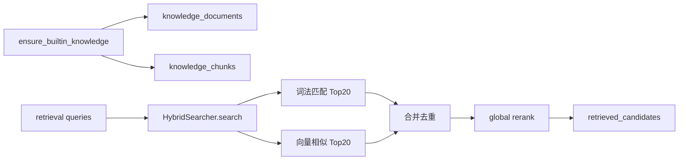

# RAG 模块设计与演进方向
> Version: v0.1.0
> Last Updated: 2026-03-12
> Status: Active

## 1. 模块定位

RAG（Retrieval-Augmented Generation）模块负责为 Agent 节点提供可追溯证据，核心目标是：

1. 从知识库中检索与需求最相关的候选片段。
2. 为 `CapabilityJudge`、`ReportComposer` 等节点提供结构化证据输入。
3. 保障“能力判断不是纯主观生成”，而是基于可追溯内容。

当前实现文件：

- `backend/app/rag/bootstrap.py`
- `backend/app/rag/search.py`

---

## 2. 当前实现架构

---

## 3. 数据对象与输入输出

## 3.1 输入

`HybridSearcher.search(...)` 输入参数：

1. `queries: list[str]`：来自 RetrievalPlanner 的查询列表。
2. `source_filters: dict`：过滤条件（当前主要使用 `module_hint`）。
3. `module_tags: list[str]`：模块/业务对象标签（当前仅预留）。
4. `top_k: int`：返回候选上限。

## 3.2 输出

输出 `list[dict]`，每个候选包含：

1. `doc_id`：来源文档 ID。
2. `doc_title`：来源文档标题。
3. `chunk_id`：切片 ID。
4. `snippet`：片段正文。
5. `source_type`：`product_doc/api_doc/constraint_doc/case`。
6. `relevance_score`：相关性分值。
7. `trust_level`：`HIGH/MEDIUM/LOW`。
8. `retrieval_stage`：`fts` 或 `vector`（用于调试与分析）。

---

## 4. 检索流程细节

## 4.1 候选召回

对每条 query，执行两路召回：

1. FTS 路：按 token overlap 得分，取 Top20。
2. 向量路：query embedding 与 chunk embedding cosine，相似度 Top20。

## 4.2 合并去重

使用 `chunk_id` 去重；同一个 chunk 若在两路都命中，保留更高分结果。

## 4.3 全局重排

将合并后的池子执行一次 global rerank：

- 调用 `model_client.rerank(" ".join(queries), snippets)`
- 最终按重排结果取 TopK

---

## 5. 知识初始化（bootstrap）

`ensure_builtin_knowledge(...)` 在知识为空时写入内置语料，确保本地环境“开箱可检索”：

1. 导出 API 说明（`api_doc/HIGH`）
2. 权限规范（`constraint_doc/HIGH`）
3. 报名业务说明（`product_doc/MEDIUM`）

初始化流程：

1. 文档切片（`chunk_document`）
2. embedding 生成（`model_client.embed_texts`）
3. 写入 `knowledge_documents` + `knowledge_chunks`

---

## 6. 当前能力与限制（客观评估）

## 6.1 优点

1. 结构简单，便于调试和本地复现。
2. 同时使用词法+向量，优于单路检索。
3. 数据结构已含 `trust_level/source_type`，可支撑后续策略化判断。

## 6.2 限制

1. 非真实全文索引：当前 FTS 是内存 token overlap，不是数据库原生 FTS。
2. 向量能力较弱：embedding 为 heuristic hash 向量，不具备语义泛化能力。
3. 过滤能力有限：`module_tags` 尚未充分利用。
4. 规模能力有限：全部 chunks 查询后在应用层打分，数据量增大会有性能瓶颈。

---

## 7. 建议演进方向（下一期）

## 7.1 检索能力升级

1. 接入真实向量索引（如 pgvector/外部向量库）并支持 ANN。
2. 使用数据库原生全文检索（PostgreSQL FTS）替代应用层 overlap。
3. 引入可配置召回配额（FTS k、Vector k、Rerank k）。

## 7.2 质量策略升级

1. 引入证据新鲜度（更新时间）与权重。
2. 增加 source_type 权重（例如 `constraint_doc` 对风险判断加权）。
3. 增加 query 扩展策略（同义词、领域词典、模板 query）。

## 7.3 可观测与评估

1. 记录每次检索的召回命中率与最终证据覆盖率。
2. 建立离线评测集（query -> 理想 evidence）做回归。
3. 增加 RAG 质量仪表盘（TopK 命中、重复率、空检索率）。

---

## 8. 与 Agent 的协作边界

1. RAG 负责提供“证据候选池”，不直接输出最终结论。
2. 能力判断的最终门禁在 `CapabilityJudgeNode`。
3. 报告撰写在 `ReportComposerNode`，RAG 只提供事实支撑内容。
