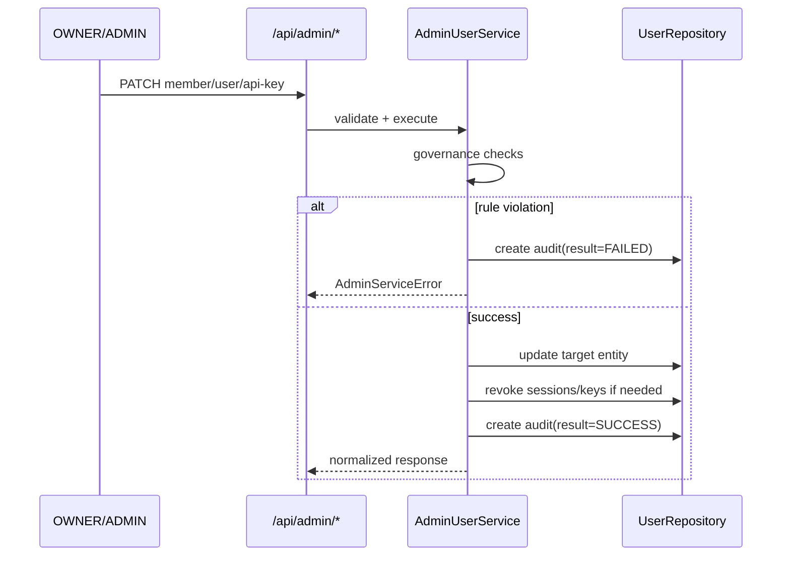

Title: Security and Governance
Version: v1.0.0
Last Updated: 2026-03-13
Scope: 认证安全、权限治理、组织隔离与审计规则
Audience: Backend engineers, security reviewers, platform maintainers

# Security and Governance

## 1. Authentication Baseline

当前认证模式由 `COPRODUCT_AUTH_MODE` 控制：

1. `jwt`（默认）：仅接受 JWT access token。
2. `hybrid`：优先 JWT，失败后可回退 legacy static token。
3. `legacy`：仅 static token（兼容模式，不建议生产使用）。

生产环境约束（`validate_security_settings`）：

1. `auth_mode` 必须为 `jwt`。
2. 关键 secret 不能使用默认开发值。
3. cookie path 必须以 `/` 开头。

## 2. Token and Session Model

1. Access token
- 类型：HS256 JWT。
- 载荷：`sub(user_id)`, `org_id`, `role`, `sid(session_id)`, `typ=access`。
- 用途：Bearer 鉴权。

2. Refresh token
- 类型：HS256 JWT。
- 载荷：`sub`, `org_id`, `sid`, `csrf`, `typ=refresh`。
- 存储：HttpOnly cookie + 服务端 hash（`auth_sessions.refresh_token_hash`）。

3. CSRF token
- 存储：非 HttpOnly cookie。
- 校验：`X-CSRF-Token` header 必须与 cookie 一致，且与 refresh JWT 的 `csrf` claim 一致。

## 3. Authorization Model

### 3.1 Role Model

权限角色（组织内）：

1. `OWNER`
2. `ADMIN`
3. `MEMBER`
4. `VIEWER`

权限判定：

1. 写业务（发起预审、再生成、上传附件）：`OWNER/ADMIN/MEMBER`。
2. 管理接口（`/api/admin/*`）：`OWNER/ADMIN`。

### 3.2 Scope Model

`CurrentUserContext` 携带 `user_id + org_id + role + auth_mode`。

数据隔离规则：

1. 所有业务查询默认按 `org_id` 过滤。
2. `MEMBER` 额外按 `created_by_user_id == self` 过滤（历史、会话、附件）。
3. 管理域操作禁止跨组织目标。

## 4. Governance Rules (Enforced in AdminUserService)

1. `ADMIN` 不能操作 `OWNER`（`OWNER_GUARD_VIOLATION`）。
2. 不能修改当前登录用户到不可用状态或不同角色（`SELF_OPERATION_FORBIDDEN`）。
3. 组织内至少保留一个 `ACTIVE OWNER`（`LAST_OWNER_PROTECTED`）。
4. 需要 active org 才允许治理写操作（`NO_ACTIVE_ORG`）。
5. 变更成员到非 ACTIVE 会联动吊销其 active sessions + API keys。
6. 吊销 API key 会联动失效该 key 签发的 active sessions。

## 5. Identity and Governance Flow

### Diagram Notes

1. 成功和失败路径都会落审计，避免“失败不可追溯”。
2. 所有规则集中在 service 层，API 层只做协议映射。

## 6. Audit and Traceability

审计字段：

1. `actor_user_id`：操作发起者。
2. `target_type + target_id`：操作对象。
3. `action`：动作类型（如 `ADMIN_UPDATE_MEMBER_ROLE`）。
4. `result`：`SUCCESS/FAILED`。
5. `meta_json`：上下文信息、失败原因、联动吊销数量等。

系统日志：

1. 后端统一使用 JSON 日志（`log_event`）。
2. 关键事件：`AUTH_LOGIN`、`AUTH_REFRESH`、`AUTH_LOGOUT`、`workflow_*`、`node_*`。

## 7. Operational Security Risks

1. `hybrid/legacy` 在生产暴露静态 token 风险。
2. 前后端域名不一致会导致 refresh/csrf cookie 失效。
3. 运行时 schema 兼容补丁不具备审计化迁移能力。

## 8. Recommended Next Hardening

1. 引入 Alembic 迁移链路，替代 runtime schema patch 作为主路径。
2. 登录失败率和 refresh 失败率增加告警阈值。
3. 增加 API key 签发/吊销频率限制与异常行为检测。
4. 逐步下线 `legacy/hybrid` 模式，仅保留 `jwt`。
