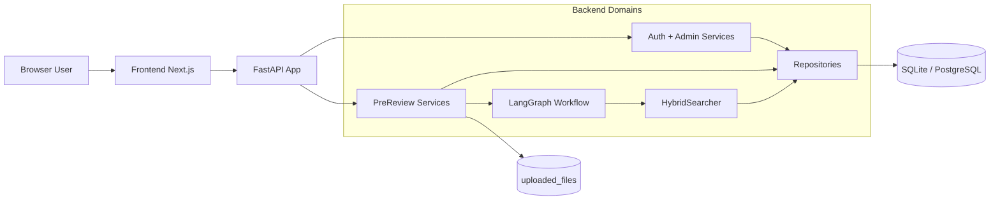
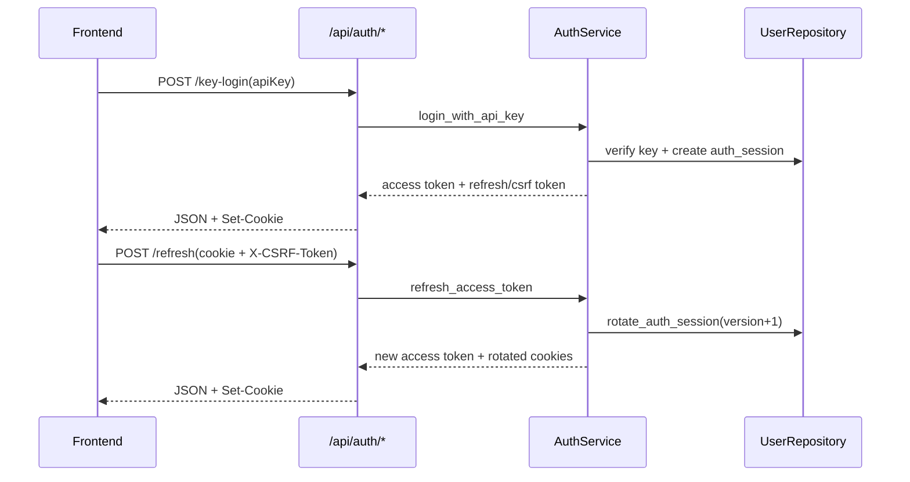
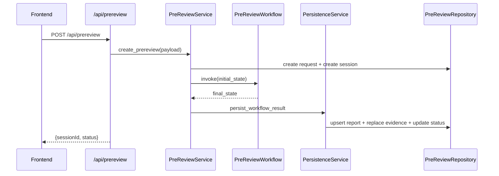

Title: System Architecture
Version: v1.0.0
Last Updated: 2026-03-13
Scope: CoProduct 组件架构、依赖关系与关键时序
Audience: Architects, backend/frontend engineers, maintainers

# System Architecture

## Architecture Style and Principles

当前系统采用“前后端分离 + 分层后端 + 工作流编排”风格：

1. 前端：Next.js App Router，负责 UI、会话恢复、路由与调用编排。
2. 后端：FastAPI + Service/Repository 分层，路由与业务规则解耦。
3. Agent：LangGraph 串行节点编排，工作流负责计算，Service 负责事务收口。
4. 存储：SQLAlchemy 模型覆盖业务域与治理域，SQLite/PostgreSQL 双运行模式。

核心原则：

1. 业务规则集中在 service 层，不散落在 API 层。
2. 鉴权、权限、数据域隔离三层分离。
3. 模型能力可替换（`model_client/factory.py` 是统一接入口）。

## Architecture Diagram (Mermaid)

### Diagram Notes

1. 所有外部请求统一进入 FastAPI，再由路由分发到对应 service。
2. 预审链路中的工作流与持久化解耦：工作流产出 state，service 决定如何落库。
3. RAG 与模型客户端属于“内部能力层”，不直接暴露 HTTP 接口。

## Components and Responsibilities

| Component | Responsibility | Key Files |
|---|---|---|
| Frontend Shell | 登录守卫、导航、页面编排、请求状态 | `frontend/src/app/*`, `components/layout/*` |
| API Routers | 参数校验、依赖注入、HTTP 错误映射 | `backend/app/api/*.py` |
| Auth/Admin Services | 登录、会话轮换、治理规则与审计 | `services/auth_service.py`, `services/admin_user_service.py` |
| PreReview Services | 预审生命周期、附件合并、结果映射 | `services/prereview_service.py`, `services/persistence_service.py` |
| Workflow Nodes | 需求解析、检索规划、证据选择、风险影响分析 | `workflow/graph.py`, `workflow/nodes/*.py` |
| Retrieval Layer | 混合检索、内置知识引导 | `rag/search.py`, `rag/bootstrap.py` |
| Data Access | 业务与治理仓储读写 | `repositories/*.py` |

## Component Dependencies

| From | To | Dependency Type | Why |
|---|---|---|---|
| Frontend | Backend API | HTTP/JSON + Cookies | 业务调用与登录态维护 |
| API Routers | Services | In-process call | 路由层不承载复杂规则 |
| Services | Repositories | In-process call | 统一数据访问边界 |
| PreReviewService | Workflow | In-process call | 编排节点执行 |
| Workflow Nodes | ModelClient | In-process call | 结构化推理/embedding/rerank |
| KnowledgeRetrieverNode | HybridSearcher | In-process call | RAG 候选检索 |
| Repositories | SQLAlchemy Engine | DB connection | 持久化与查询 |

## Key Sequences (Mermaid)

### Sequence A: Login + Refresh

### Diagram Notes

1. refresh 成功的前提是 refresh token hash 与会话版本匹配。
2. refresh 失败会返回 `TOKEN_EXPIRED` 或 `PERMISSION_DENIED`（CSRF mismatch）。

### Sequence B: Create PreReview

### Diagram Notes

1. 工作流执行异常时，`persist_workflow_failure` 会把会话状态落为 `FAILED`。
2. API 返回 `status=PROCESSING` 作为前端统一轮询入口。

## Non-Functional Concerns

1. Security
- JWT + refresh cookie + CSRF 双提交校验。
- 管理接口统一 `OWNER/ADMIN` 校验。
2. Reliability
- 风险/影响节点采用降级策略（失败时返回空列表，不阻断全链路）。
- 启动时自动补齐旧库缺失列，避免本地历史数据直接崩溃。
3. Performance
- 当前为串行 workflow，延迟受最慢节点影响。
- 历史与管理列表均支持分页。
4. Maintainability
- service/repository 边界清晰，便于后续引入 migration、外部模型、队列。

## Design Tradeoffs

1. 选择 deterministic HeuristicModelClient
- 优点：本地可复现、调试稳定、无云依赖。
- 代价：语义能力有限，预审质量上限较低。
2. 选择运行时 schema compatibility
- 优点：快速兼容旧 SQLite 本地库。
- 代价：缺乏版本化迁移审计，生产治理能力不足。
3. 选择 JWT + cookie 混合
- 优点：前端调用方便（Bearer），刷新安全性更好（HttpOnly cookie）。
- 代价：跨域与同站点配置复杂度提高。
