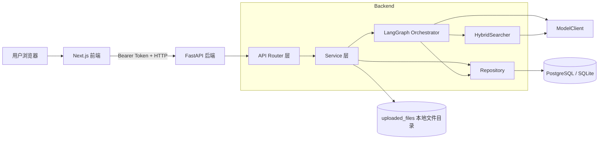
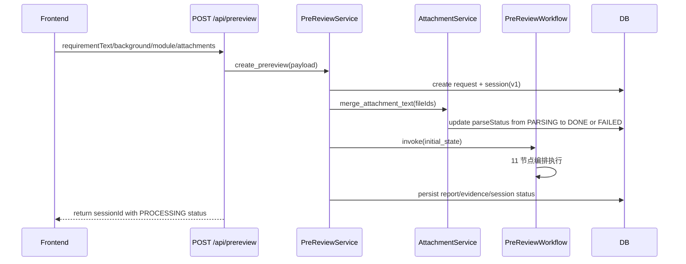
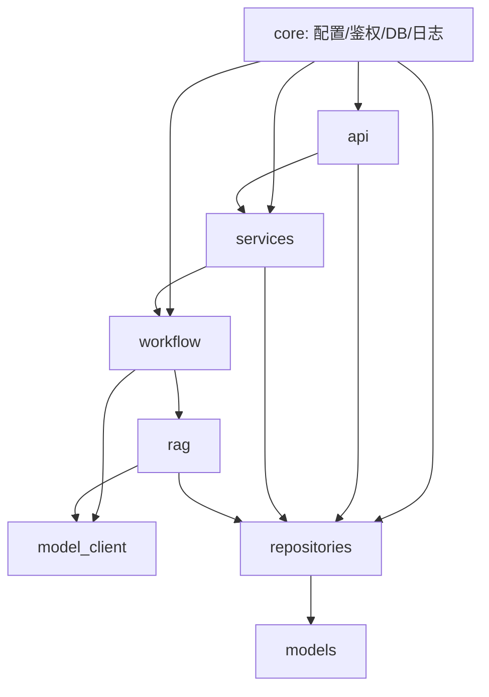
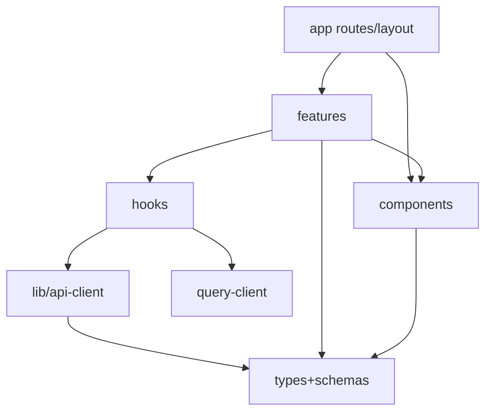

# CoProduct 系统全景介绍
> Version: v0.1.1
> Last Updated: 2026-03-12
> Status: Active

## 1. 系统定位

CoProduct 是一个前后端分离的需求预审系统，目标是在正式评审前完成以下动作：

1. 对需求进行能力判断（`SUPPORTED` / `PARTIALLY_SUPPORTED` / `NOT_SUPPORTED` / `NEED_MORE_INFO`）。
2. 将自然语言需求整理为结构化草案。
3. 输出缺失信息、风险、影响范围与下一步建议。
4. 支持附件上传、补充信息再生成（版本链）、历史查询回看。

当前版本对应：

- 后端：M3（版本链、附件闭环、历史查询、降级策略）
- 前端：M3.1（统一入口页 + 全局导航壳 + 跨页面跳转）

---

## 2. 当前系统能力边界

### 2.1 已实现能力

1. `POST /api/prereview` 发起预审并触发 LangGraph 工作流。
2. `GET /api/prereview/{session_id}` 查询字段级结果视图。
3. `POST /api/prereview/{session_id}/regenerate` 基于历史会话再生成并创建新版本。
4. `POST /api/files/upload` 上传附件并返回 `fileId/fileName/fileSize/parseStatus`。
5. `GET /api/history` 支持 `keyword` + `capabilityStatus` + 分页查询。
6. 附件解析状态流转：`PENDING -> PARSING -> DONE|FAILED`。
7. 风险/影响节点降级：节点异常时不阻断主流程（返回空区块）。

### 2.2 当前设计约束

1. ModelClient 默认是本地 `HeuristicModelClient`（规则与启发式），未接入云端大模型。
2. 附件解析目前最小支持 `.txt/.md`；`.pdf/.docx` 上传可成功，但解析会降级失败并记录日志。
3. RAG 语料默认通过启动时内置种子文档初始化（用于本地可用性验证）。

---

## 3. 总体架构

说明：

1. 前端只负责输入、展示和交互状态，不承载 AI 推理逻辑。
2. 后端以 Service 层为入口，驱动 PreReview 工作流。
3. 工作流通过 ModelClient 执行结构化生成、向量化、重排。
4. 数据和状态最终通过 Repository 持久化到数据库。

---

## 4. 关键业务流程

## 4.1 创建预审流程（Create）

## 4.2 再生成流程（Regenerate）

1. 读取父 session 与 request。
2. 创建子 session：`version = parent.version + 1`，`parent_session_id = parent.id`。
3. 读取补充说明与附件文本，重新执行完整工作流。
4. 前端跳转新 `sessionId`。

## 4.3 结果查询流程（Detail）

1. 根据 `session_id` 查 `sessions/reports/evidence_items`。
2. `PersistenceService` 将内部 `report_json` 映射为前端稳定 view model。
3. 若会话不存在，返回 404，错误体中带 `status: NOT_FOUND`。

## 4.4 历史查询流程（History）

1. `GET /api/history` 进入 `HistoryService`。
2. Repository 执行联表查询（`sessions + requests + reports`）。
3. 支持条件：`keyword`、`capabilityStatus`，排序按 `started_at` 倒序。

---

## 5. 后端模块依赖关系

依赖原则：

1. API 不直接编排节点，统一通过 Service。
2. 节点不直接操作数据库（持久化由 Service/Repository 负责）。
3. ModelClient 是算法能力接口层，方便后续切换云模型。

---

## 6. 前端模块依赖关系

说明：

1. 组件层不直接请求后端，统一走 hooks + api-client。
2. `api-client` 负责请求、超时、错误码映射和响应归一化。
3. `AppShell` 提供统一导航入口（首页/新建/历史）。

---

## 7. 运行时配置与外部依赖

## 7.1 后端关键环境变量

1. `COPRODUCT_API_TOKEN`
2. `COPRODUCT_DATABASE_URL`
3. `COPRODUCT_UPLOAD_DIR`
4. `COPRODUCT_UPLOAD_MAX_SIZE_MB`
5. `COPRODUCT_CORS_ALLOW_ORIGINS`

## 7.2 前端关键环境变量

1. `NEXT_PUBLIC_API_BASE_URL`
2. `NEXT_PUBLIC_API_TOKEN`

## 7.3 基础依赖

1. 后端：FastAPI、LangGraph、SQLAlchemy、Pydantic。
2. 前端：Next.js、React Query、React Hook Form、Zod。

---

## 8. 稳定性与降级策略（当前实现）

1. 网络层：前端 API 调用内置超时（15s）与错误码友好映射。
2. 工作流层：`RiskAnalyzer` / `ImpactAnalyzer` 异常时降级为空列表并继续。
3. 能力判断门禁：高质量证据不足时禁止输出 `SUPPORTED`。
4. 附件层：解析失败不阻断主流程，保留追踪日志与状态。

---

## 9. 推荐阅读路径

1. [后端架构与模块关系](./backend_architecture.md)
2. [后端 Service 层详解](./backend_services.md)
3. [后端 API 参考（重要接口详解）](./backend_api_reference.md)
4. [核心 Agent 编排器（PreReview Orchestrator）](./agent_orchestrator.md)
5. [RAG 模块设计与演进方向](./rag_design.md)
6. [数据模型与持久化设计](./data_and_persistence.md)
7. [前端架构与交互链路](./frontend_architecture.md)
8. [运行与联调手册](./ops_and_runbook.md)
9. [系统现状评估与下一期开发方向](./improvement_and_next_phase.md)
