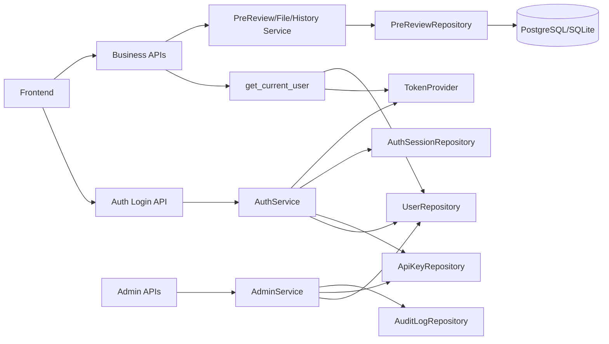
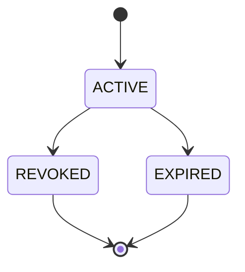
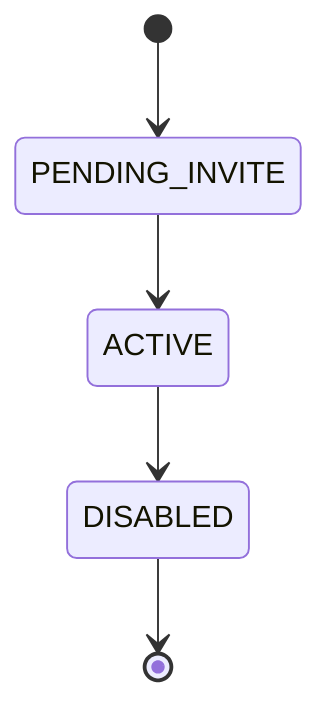

# 总体技术设计方案 - user_management
> Version: v0.2.0
> Last Updated: 2026-03-12
> Status: Draft

## 1. 背景与目标

当前系统仍使用单一全局 `COPRODUCT_API_TOKEN` 做鉴权，存在以下问题：

1. 无用户身份，无法区分“谁发起了预审/上传文件”。
2. 无团队权限边界，历史数据天然全局可见，缺少团队管理能力。
3. 无会话管理与审计能力，无法满足后续团队协作与治理需求。

本需求目标：

1. 建立可用的用户体系，支持“API Key 登录 -> Token 调用业务 API”。
2. 业务数据绑定用户与组织，默认做到最小权限隔离。
3. 在不优先开发复杂 Admin UI 的前提下，先把后端治理能力和前后端契约打稳。
4. 预留后续组织化管理、邀请制注册、SSO 接入扩展点。

## 2. 范围（In/Out）

### 2.1 In Scope

1. 认证模型升级：
- API Key 仅用于登录入口。
- 业务调用改为短期 Access Token（JWT）+ Refresh Token。
2. 用户与组织基础模型：
- `organizations/users/memberships/api_keys/auth_sessions/audit_logs`。
3. RBAC 基础权限：`OWNER/ADMIN/MEMBER/VIEWER`。
4. 数据归属补齐：预审请求、会话、上传文件写入 `org_id/created_by_user_id`。
5. 管理能力先通过后端 API 提供，不强依赖完整 Admin UI。

### 2.2 Out of Scope（本轮不做）

1. 企业级 SSO（OIDC/SAML）完整接入。
2. 多组织切换 UI 与复杂权限策略（ABAC）可视化编辑。
3. 细粒度资源授权（字段级、文档级 ACL）。

## 3. 总体架构与关键流程

### 3.1 架构摘要

1. 新增认证域：`auth api + auth service + user repository + token provider`。
2. 原业务域（prereview/files/history）改为依赖 `get_current_user`。
3. 前端新增登录态管理层，统一给 API 请求附加 Access Token。
4. 管理员操作（用户开通、密钥签发/吊销）通过后端管理接口完成。

### 3.2 关键链路

1. 登录链路：
- 用户输入 API Key。
- 后端校验 `api_keys`（hash 比较、状态、过期、用户状态）。
- 签发 `access_token + refresh_token`，记录 `auth_sessions`。
2. 业务调用链路：
- 前端带 `Authorization: Bearer <access_token>`。
- `get_current_user` 解码 token，校验会话状态。
- 注入 `CurrentUser` 给业务服务。
3. 刷新链路：
- 前端在 Access Token 过期时调用 refresh。
- 服务端轮换 refresh token 并更新 `auth_sessions`。
4. 管理链路：
- 管理员通过后端 API 创建/禁用用户、签发/吊销 key。
- 关键操作写入 `audit_logs`。

### 3.3 认证与令牌传输澄清（v0.2.0）

> Obsolete in v0.2.0: 旧版文档对 refresh token 传输方式存在“Cookie 与请求体并存”的歧义。

本版本统一约束：

1. `accessToken` 通过响应体返回，前端存内存并通过 `Authorization` 发送。
2. `refreshToken` 仅通过 `Set-Cookie` 下发与轮换，不在 JSON 响应体明文返回。
3. `POST /api/auth/refresh` 与 `POST /api/auth/logout` 默认不接收 `refreshToken` 请求体字段。
4. 浏览器场景启用 CSRF 双提交策略：
- Cookie：`csrf_token`（非 HttpOnly）。
- Header：`X-CSRF-Token`，其值必须与 `csrf_token` 一致。

## 4. 数据与状态模型

### 4.1 核心数据模型

新增表：

1. `organizations`
2. `users`
3. `memberships`
4. `api_keys`
5. `auth_sessions`
6. `audit_logs`

改造既有表：

1. `requests` 增加 `org_id`, `created_by_user_id`
2. `sessions` 增加 `org_id`, `created_by_user_id`
3. `uploaded_files` 增加 `org_id`, `created_by_user_id`

### 4.2 状态模型

1. 用户状态：`ACTIVE | DISABLED | PENDING_INVITE`
2. API Key 状态：`ACTIVE | REVOKED | EXPIRED`
3. Auth Session 状态：`ACTIVE | REVOKED | EXPIRED`
4. 角色：`OWNER | ADMIN | MEMBER | VIEWER`

### 4.3 状态模型澄清（v0.2.0）

> Obsolete in v0.2.0: 上述状态图将用户状态与 key/session 状态混用，语义不清。

本版本拆分为三个状态机：

1. 用户状态：`PENDING_INVITE -> ACTIVE -> DISABLED`。
2. API Key 状态：`ACTIVE -> REVOKED`，或到期变为 `EXPIRED`。
3. Auth Session 状态：`ACTIVE -> REVOKED`，或到期变为 `EXPIRED`。

### 4.4 数据访问策略（v0.2.0）

1. 组织隔离：所有业务数据先按 `org_id` 过滤。
2. 角色范围：
- `OWNER/ADMIN`：可读写组织内全部数据。
- `MEMBER`：仅可读写自己创建的数据（`created_by_user_id=self`）。
- `VIEWER`：仅可读组织内数据，不可写操作。
3. 业务接口权限：
- `POST /api/prereview`、`POST /api/prereview/{session_id}/regenerate`、`POST /api/files/upload`：`OWNER/ADMIN/MEMBER`。
- `GET /api/prereview/{session_id}`、`GET /api/prereview/history`：`OWNER/ADMIN/VIEWER` 组织级可见，`MEMBER` 仅本人数据。

## 5. 阶段规划（Phase 1..N）

### Phase 1：身份基础与业务接管

1. 新增用户/组织/密钥/会话/审计表与迁移。
2. 增加 `/api/auth/key-login`, `/api/auth/refresh`, `/api/auth/logout`, `/api/auth/me`。
3. 业务接口接入 `get_current_user`。
4. 业务数据写入 `org_id/created_by_user_id`。
5. 前端完成登录页、token 管理、401 自动处理。

### Phase 2：团队治理能力

1. 新增管理员 API（用户开通、禁用、角色调整、密钥管理）。
2. 历史与详情查询按角色执行数据隔离策略。
3. 审计日志查询与导出接口。
4. 前端补管理员最小可用页面（列表+关键操作）。

### Phase 3：安全与可扩展增强

1. 邀请制注册与首次激活流程。
2. 速率限制、异常登录告警、token 风险控制。
3. 预留 OIDC 接口层，准备后续 SSO 对接。

## 6. 风险与回滚策略

### 6.1 主要风险

1. 鉴权切换期间，老接口可能出现兼容断档。
2. 数据归属字段补齐后，历史旧数据权限归属可能不明确。
3. 刷新会话逻辑引入后，token 失效边界处理复杂度上升。

### 6.2 缓解策略

1. 设置短期兼容窗口：保留 `COPRODUCT_API_TOKEN` 的开发后门，仅限 `app_env=dev`。
2. 做数据回填脚本，为历史数据写默认 `org_id/created_by_user_id`。
3. 定义统一错误码（`AUTH_ERROR/TOKEN_EXPIRED/PERMISSION_DENIED`）并前后端一致处理。
4. 对关键鉴权链路增加集成测试和回归清单。

### 6.3 回滚策略

1. 后端可通过 feature flag 退回“静态 token”模式（仅应急短时）。
2. 新增表不影响原业务主键结构，可按路由开关灰度切换。
3. 登录失败异常时，业务服务可快速切回本地调试 token（仅开发环境）。
