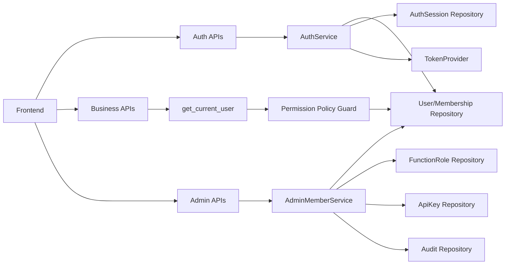

# 总体技术设计方案 - user_management
> Version: v0.5.0
> Last Updated: 2026-03-12
> Status: Draft

> Design Priority (v0.5.0): 若旧段落与 v0.5.0 新增规则冲突，以 v0.5.0 为准；v0.4.0 作为兼容基线保留。

## 1. 背景与目标

当前系统在完成 Phase 1/2 后已具备基础认证与管理能力，但仍存在治理层面的关键缺口：

1. `OWNER/ADMIN` 权限边界不清晰，治理风险仍高。
2. 缺少“危险操作红线”约束（如自降权、自禁用、组织无 owner）。
3. 用户建模仍偏粗糙，未清晰拆分“全局身份”与“组织内身份”。
4. 缺少成员“职能角色”（如产品经理、运营）建模，不利于团队协作与审计。
5. 组织上下文暴露不统一：前端创建成员仍可手工输入 `orgId`，与当前“登录态=用户+组织”模型不一致。
6. API Key 签发仍需手工输入 `userId`，可用性差且在多组织扩展时易产生目标成员歧义。

本版本目标：

1. 建立清晰且可扩展的身份域建模：`UserAccount` + `OrgMembership`。
2. 固化权限红线与组织治理规则，避免管理员误操作导致系统失管。
3. 新增“职能角色（Functional Role）”模型，约束一个成员仅绑定一个职能角色。
4. 在兼容现有接口的前提下，明确后续成员管理 API 的演进方向。
5. 增加统一“登录上下文（auth context）”契约，明确当前组织与可用组织集合，为后续多登录方式预留能力。
6. 将 API Key 签发升级为“组织上下文 + 成员搜索”交互，替代手工输入 `userId`。

## 2. 范围（In/Out）

### 2.1 In Scope（v0.3.0 新增）

1. 身份模型细化：
- 全局身份：`users`（账号维度，跨组织唯一）。
- 组织内身份：`memberships`（组织维度，承载权限角色与成员状态）。
2. 权限模型细化：
- 明确 `OWNER` 与 `ADMIN` 的差异化边界。
- 增加治理红线约束与失败审计。
3. 职能角色模型：
- 新增 `org_function_roles`。
- `memberships.functional_role_id` 单值绑定（每个成员仅一个职能角色）。
4. 管理 API 演进：
- 在保留 `/api/admin/users/*` 兼容路径下，逐步引入 `/api/admin/members/*` 语义。
5. 登录上下文显式化：
- 新增 `AuthContext` 概念：`activeOrg + availableOrgs + scopeMode`。
- 前端创建成员不再手工输入组织 ID，改为上下文驱动选择。
6. API Key 签发目标显式化（v0.5.0 新增）：
- API Key 签发表单不再暴露“纯 userId 文本输入”作为主路径。
- 通过当前组织下成员检索（邮箱/名称前缀）选择签发目标。

### 2.2 Out of Scope（本轮不做）

1. 企业级 SSO（OIDC/SAML）完整接入。
2. 完整多组织切换 UI 与跨组织委派管理（本轮仅交付“上下文能力 + 单组织下拉”）。
3. 细粒度 ABAC 策略编辑器与工作流审批。
4. 跨组织全量全文搜索成员目录（本轮仅做当前组织前缀检索）。

## 3. 总体架构与关键流程

### 3.1 架构摘要

1. 认证域：`auth api + auth service + token provider + session repository`。
2. 身份域：`users + memberships + org_function_roles`。
3. 治理域：`admin member/key/audit APIs + policy guard`。
4. 前端分层：认证状态层、权限门禁层、管理端领域层（成员/职能/密钥/审计）。

### 3.2 关键链路

1. 登录链路：
- API Key 鉴权通过后，解析到 `user + membership`，签发 access/refresh token。
2. 鉴权链路：
- token 解码后以服务端 membership 为准，动态覆盖 token 中的旧 role。
3. 管理链路：
- 成员管理操作先过权限判定，再过“治理红线”判定，最后写审计。
4. 职能链路：
- 成员创建/更新必须绑定单一职能角色（可使用默认 `unassigned`）。
5. 上下文链路（v0.4.0 新增）：
- 客户端登录后先获取 `AuthContext`，再执行管理域操作。
- 管理端创建成员时组织来源于 `AuthContext`，禁止自由文本输入组织 ID。
6. API Key 签发链路（v0.5.0 新增）：
- 先确定签发组织上下文（当前阶段默认 `ORG_SCOPED` 固定组织，未来支持 `USER_SCOPED` 选择组织）。
- 再通过“成员检索接口”选择签发目标，后端二次校验目标成员属于该组织并处于可签发状态。

## 4. 数据与状态模型

### 4.1 身份模型分层（v0.3.0）

1. `UserAccount`（全局身份）
- 语义：用户是谁（跨组织唯一）。
- 建议字段：`id/email/display_name/account_status/created_at/disabled_at`。
2. `OrgMembership`（组织内身份）
- 语义：用户在某组织内是谁（权限、职能、成员状态）。
- 建议字段：`id/user_id/org_id/permission_role/functional_role_id/member_status`。
3. `OrgFunctionalRole`（组织职能角色）
- 语义：组织内职能字典。
- 建议字段：`id/org_id/code/name/description/is_active/sort_order`。

> Obsolete in v0.3.0: 旧版将“用户状态 + 组织成员状态”混合表达，语义不清。

### 4.2 状态模型（v0.3.0）

1. 账号状态（`users.account_status`）：`ACTIVE | LOCKED | DELETED`
2. 成员状态（`memberships.member_status`）：`INVITED | ACTIVE | SUSPENDED | REMOVED`
3. API Key 状态：`ACTIVE | REVOKED | EXPIRED`
4. Auth Session 状态：`ACTIVE | REVOKED | EXPIRED`

### 4.3 权限角色与职能角色

1. 权限角色（`permission_role`）决定可执行操作：`OWNER | ADMIN | MEMBER | VIEWER`
2. 职能角色（`functional_role`）仅用于团队职能表达，不直接决定系统权限。
3. 单成员单职能约束：一个 membership 只能绑定一个 `functional_role_id`。

### 4.4 权限边界（v0.3.0）

| 能力 | OWNER | ADMIN | MEMBER | VIEWER |
|---|---|---|---|---|
| 组织治理（owner 交接/关键安全策略） | ✅ | ❌ | ❌ | ❌ |
| 管理 OWNER 成员 | ✅ | ❌ | ❌ | ❌ |
| 管理 ADMIN/MEMBER/VIEWER | ✅ | ✅ | ❌ | ❌ |
| 业务写（预审/再生成/上传） | ✅ | ✅ | ✅(本人数据) | ❌ |
| 业务读（历史/详情） | ✅(组织全量) | ✅(组织全量) | ✅(本人数据) | ✅(组织只读) |

### 4.5 治理红线（v0.3.0）

1. 组织必须始终至少有一个 `ACTIVE OWNER`。
2. `ADMIN` 不能修改任何 `OWNER` 的角色/状态。
3. `OWNER` 不能直接把自己降为非 owner 或禁用自己（需先完成 owner 交接）。
4. 禁用成员时，必须联动失效其 active sessions 与 active API keys。
5. 所有拒绝类高风险操作也必须写入审计日志。

## 5. 接口演进策略

### 5.1 兼容原则

1. 现有 `/api/admin/users/*` 在兼容窗口保留。
2. 新语义优先：逐步迁移到 `/api/admin/members/*`。
3. 字段演进采用“新增优先、保留旧字段”策略，避免破坏前端。

### 5.2 新增接口方向（规划）

1. `GET /api/admin/functional-roles`
2. `POST /api/admin/functional-roles`
3. `PATCH /api/admin/members/{member_id}/functional-role`

## 6. 阶段规划（Phase 1..N）

### Phase 1（已完成）

1. 新增用户/组织/密钥/会话/审计表与迁移。
2. 认证接口与业务鉴权接管。

### Phase 2（已完成）

1. 管理员 API（用户/密钥/审计）与最小管理页面。

### Phase 3（在研）

1. 安全增强（邀请、限流、会话安全）。

### Phase 4（v0.3.0 新增）

1. 身份模型细化（全局身份 vs 组织内身份）。
2. 权限红线治理规则落地（至少一个 owner、禁止危险自操作）。
3. 职能角色模型与成员单职能约束落地。
4. 管理 API 语义升级（users -> members，保留兼容层）。

### Phase 5（v0.4.0 新增）

1. 登录上下文接口落地（`GET /api/auth/context`），统一返回 `activeOrg` 与 `availableOrgs`。
2. 创建成员交互改造为“组织下拉选择”，默认当前组织，移除手工输入组织 ID。
3. 对“无组织上下文”返回明确错误码并给出可恢复提示。
4. 为未来 `user-scoped` 登录（单用户多组织）预留契约，不与现有 API Key 登录冲突。

### Phase 6（v0.5.0 新增）

1. API Key 签发交互从“手工 userId”升级为“成员检索选择”。
2. 签发流程增加组织维度显式选择能力（`ORG_SCOPED` 锁定，`USER_SCOPED` 预留）。
3. 新增成员检索契约，支持按邮箱/显示名前缀查询当前组织成员。
4. API Key 列表增强可读信息（目标成员邮箱/显示名），减少运维定位成本。

## 7. 风险与缓解

### 7.1 主要风险（新增）

1. 风险：权限边界调整导致旧前端行为与后端策略冲突。
- 缓解：后端返回明确错误码与可操作原因，前端按策略禁用按钮。
2. 风险：模型迁移阶段出现 membership 与 functional role 不一致。
- 缓解：迁移分步执行，先补默认 `unassigned` 职能后再加非空约束。
3. 风险：治理红线引入后出现“无法执行管理操作”的运营阻塞。
- 缓解：提供 owner 交接流程与 break-glass 操作手册（审计留痕）。

### 7.2 回滚策略

1. 接口层回滚：保留 `/api/admin/users/*` 兼容路径作为短期退路。
2. 数据层回滚：不回滚核心身份字段，仅允许脚本修复脏数据。
3. 策略层回滚：红线策略可配置降级，但降级必须记录审计事件。

## 8. 需求台账（v0.5.0 增量）

| TD ID | 需求描述 | Owner | Priority |
|---|---|---|---|
| TD-401 | 登录后必须可获取统一上下文（当前组织 + 可用组织 + 作用域模式） | BE | P0 |
| TD-402 | 创建成员时组织选择必须来自上下文，不允许手工自由输入 | FE | P0 |
| TD-403 | 在 `ORG_SCOPED` 模式下，管理操作默认绑定当前组织，跨组织请求必须拒绝 | FE/BE | P0 |
| TD-404 | 契约需兼容未来 `USER_SCOPED` 登录（一个用户可见多个组织） | FE/BE | P1 |

> Obsolete in v0.4.0: “创建成员通过文本框输入 `orgId`”被标记为过时交互，仅保留兼容字段，不再作为主路径。

| TD ID | 需求描述 | Owner | Priority |
|---|---|---|---|
| TD-501 | API Key 签发表单必须支持通过成员搜索选择目标用户，不再依赖手工输入 userId | FE | P0 |
| TD-502 | 后端提供组织内成员检索契约（邮箱/显示名前缀），仅返回签发所需字段 | BE | P0 |
| TD-503 | API Key 签发需显式绑定组织上下文；跨组织 userId/orgId 组合必须拒绝 | FE/BE | P0 |
| TD-504 | API Key 列表应提供目标成员可读信息（邮箱/显示名）以提升管理可用性 | FE/BE | P1 |
| TD-505 | 组织选择能力需兼容未来 USER_SCOPED 登录，不破坏 ORG_SCOPED 现有行为 | FE/BE | P1 |

> Obsolete in v0.5.0: API Key 签发表单中“手工输入 userId 文本框”被标记为过时交互，仅作为兼容调试入口，不再作为主路径。

## 9. 风险 -> 缓解 -> 实现映射（v0.5.0 增量）

| 风险 | 缓解策略 | 技术实现锚点 |
|---|---|---|
| 前端继续手填 `orgId` 导致组织越权歧义 | UI 改为下拉，组织来源受控 | FE 表单改造 + `AuthContext` 消费（TD-402/TD-403） |
| 登录方式扩展后上下文口径不一致 | 抽象 `scopeMode`，统一上下文响应 | `GET /api/auth/context` 契约与服务实现（TD-401/TD-404） |
| 当前用户无组织时管理功能行为不明确 | 新增明确错误码与前端提示 | `NO_ACTIVE_ORG` 错误码 + FE 引导态（TD-403） |
| API Key 目标账号靠手输 userId，易输错且学习成本高 | 改为组织内成员检索选择，提交隐藏 userId | 新增成员检索接口 + 前端自动补全组件（TD-501/TD-502） |
| 未来多组织场景下签发目标组织不明确 | 签发请求增加组织语义并与上下文联动校验 | `IssueApiKeyRequest.orgId?` + 服务层跨组织拦截（TD-503/TD-505） |
| API Key 列表仅展示 userId，排障效率低 | 增补成员可读字段（邮箱/显示名） | 列表响应字段扩展 + 前端列展示升级（TD-504） |
