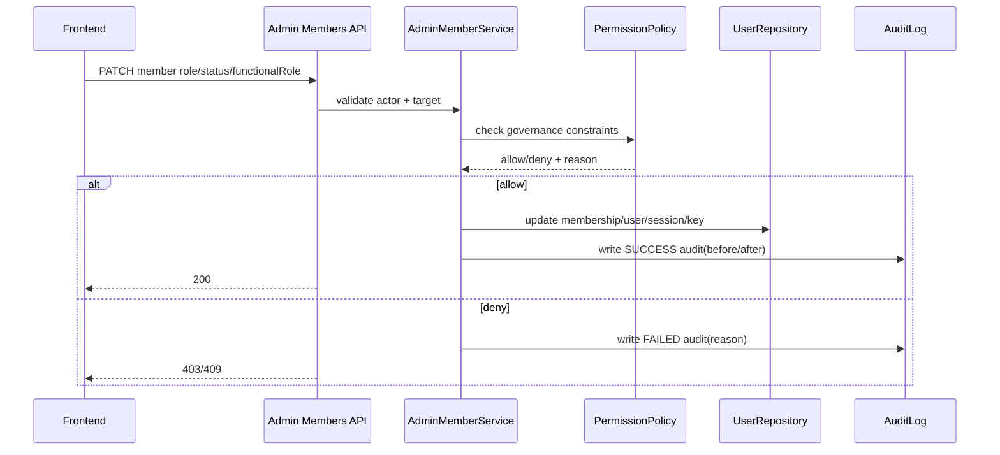

# 后端技术落地方案 - user_management
> Version: v0.3.0
> Last Updated: 2026-03-12
> Status: Draft

> Design Priority (v0.3.0): 若旧段落与 v0.3.0 新增规则冲突，以 v0.3.0 为准。

## 1. 模块边界与服务分层

### 1.1 已有模块（Phase 1/2）

1. `app/api/auth.py`：认证接口。
2. `app/api/admin_users.py`、`app/api/admin_api_keys.py`、`app/api/admin_audit_logs.py`：管理接口。
3. `app/services/auth_service.py`：登录、刷新、登出、当前用户解析。
4. `app/services/admin_user_service.py`：用户/密钥/审计管理能力。
5. `app/repositories/user_repository.py`：用户域持久化。
6. `app/models/user_management.py`：组织、用户、成员关系、密钥、会话、审计。

### 1.2 v0.3.0 新增模块

1. `app/api/admin_members.py`：成员语义接口（兼容层保留旧 users 路由）。
2. `app/api/admin_functional_roles.py`：职能角色管理接口。
3. `app/services/admin_member_service.py`：成员治理规则与红线判定。
4. `app/core/permission_policy.py`：权限判断 + 治理红线集中封装。

## 2. 身份与权限模型实现

### 2.1 身份模型分层（v0.3.0）

1. `users` 代表全局身份（账号维度）。
2. `memberships` 代表组织内身份（权限与成员状态维度）。
3. `org_function_roles` 代表组织内职能角色字典。

### 2.2 关键字段与约束

1. `memberships.permission_role`: `OWNER|ADMIN|MEMBER|VIEWER`
2. `memberships.member_status`: `INVITED|ACTIVE|SUSPENDED|REMOVED`
3. `memberships.functional_role_id`: FK -> `org_function_roles.id`（单值绑定）
4. 约束：
- `UNIQUE(user_id, org_id)`
- `org_function_roles.UNIQUE(org_id, code)`
- `functional_role.org_id == membership.org_id`（服务层强校验 + 复合约束）

> Obsolete in v0.3.0: 旧版仅以 `users.status + memberships.role` 表达成员状态，无法完整覆盖治理场景。

### 2.3 权限边界实现

1. `OWNER`：
- 可执行所有管理能力。
- 唯一可管理 owner 成员与组织治理策略。
2. `ADMIN`：
- 可管理非 owner 成员。
- 禁止调整 owner 的角色/状态。
3. `MEMBER/VIEWER`：
- 无管理域权限。

### 2.4 治理红线实现（必须硬编码为后端规则）

1. 至少一个 active owner：
- 任何角色/状态变更都必须校验组织 active owner 数量。
2. 禁止危险自操作：
- 禁止 owner 自降权、owner 自禁用。
- 对非 owner 角色同理禁止把自己改成不可恢复状态（可按策略配置）。
3. 高风险拒绝行为审计：
- 拒绝类操作写 `result=FAILED` 审计，记录 `reason`。

## 3. 接口与流程编排

### 3.1 管理接口演进

1. 兼容保留：`/api/admin/users/*`
2. 新增主路径：`/api/admin/members/*`
3. 职能接口：
- `GET /api/admin/functional-roles`
- `POST /api/admin/functional-roles`
- `PATCH /api/admin/members/{member_id}/functional-role`

### 3.2 成员变更流程（v0.3.0）

### 3.3 错误码扩展建议

1. `OWNER_GUARD_VIOLATION`
2. `SELF_OPERATION_FORBIDDEN`
3. `FUNCTION_ROLE_MISMATCH`
4. `LAST_OWNER_PROTECTED`

## 4. 持久化与迁移策略

### 4.1 新增与变更表（Phase 4）

1. 新增 `org_function_roles`。
2. 变更 `memberships`：
- 增加 `functional_role_id`
- 增加 `member_status`
3. 可选：`users.status` 重命名为 `account_status`（或增加别名列做兼容）。

### 4.2 迁移步骤（建议）

1. Step A：建表 + 新字段可空 + 索引。
2. Step B：为每个组织写入默认职能 `unassigned`，回填 membership。
3. Step C：增加非空/外键约束与一致性校验。

### 4.3 数据一致性校验

1. membership 空 `functional_role_id` 行数必须为 0。
2. membership 与 functional role 跨 org 绑定行数必须为 0。
3. 每个组织 active owner 数量必须 >= 1。

## 5. 审计与可观测性（增强）

### 5.1 审计字段增强

1. 必填：`request_id`, `actor_user_id`, `org_id`, `action`, `result`, `target_type`, `target_id`
2. 扩展：`reason`, `before_json`, `after_json`, `ip`, `user_agent`

### 5.2 指标增强

1. `admin_policy_denied_total{reason}`
2. `last_owner_guard_block_total`
3. `self_operation_block_total`

## 6. 权限矩阵（v0.3.0）

| 接口 | OWNER | ADMIN | MEMBER | VIEWER |
|---|---|---|---|---|
| `GET /api/admin/members` | ✅ | ✅ | ❌ | ❌ |
| `PATCH /api/admin/members/{id}/role` | ✅ | ✅(非 owner) | ❌ | ❌ |
| `PATCH /api/admin/members/{id}/status` | ✅ | ✅(非 owner) | ❌ | ❌ |
| `PATCH /api/admin/members/{id}/functional-role` | ✅ | ✅(非 owner) | ❌ | ❌ |
| `GET/POST /api/admin/functional-roles` | ✅ | ✅ | ❌ | ❌ |
| `POST/GET /api/admin/api-keys*` | ✅ | ✅(非 owner) | ❌ | ❌ |
| `GET /api/admin/audit-logs` | ✅ | ✅ | ❌ | ❌ |

## 7. 阶段映射（Phase 1..N）

### Phase 1（已完成）

1. 认证与业务鉴权接管。

### Phase 2（已完成）

1. 管理员接口最小能力上线。

### Phase 3（在研）

1. 邀请、风控、会话安全增强。

### Phase 4（v0.3.0 新增）

1. 身份模型细化（全局身份 vs 组织成员身份）。
2. 权限边界差异化（OWNER vs ADMIN）。
3. 治理红线落地（至少一个 owner + 禁止危险自操作）。
4. 职能角色建模与接口上线。

## 8. 风险点与缓解（v0.3.0）

1. 风险：权限收紧后历史自动化脚本失败。
- 缓解：灰度期保留兼容接口 + 审计提示 + 脚本迁移指南。
2. 风险：成员迁移期间出现组织/职能错绑。
- 缓解：迁移脚本强校验 + 失败即回滚事务。
3. 风险：治理红线影响紧急处理效率。
- 缓解：提供受控 break-glass 路径，要求双人复核并强审计。
