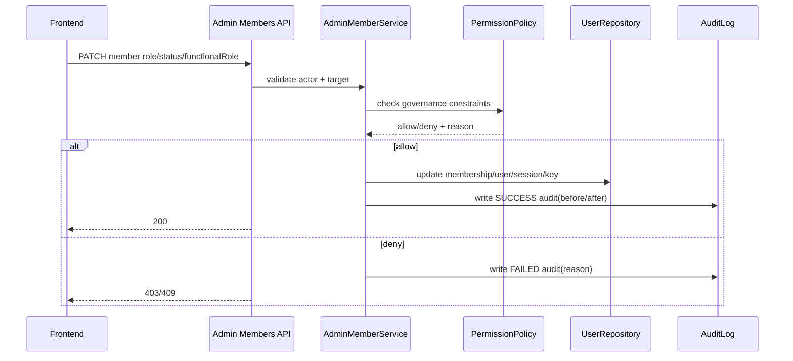

# 后端技术落地方案 - user_management
> Version: v0.5.0
> Last Updated: 2026-03-12
> Status: Draft

> Design Priority (v0.5.0): 若旧段落与 v0.5.0 新增规则冲突，以 v0.5.0 为准；v0.4.0 作为兼容基线保留。

## 1. 模块边界与服务分层

### 1.1 已有模块（Phase 1/2）

1. `app/api/auth.py`：认证接口。
2. `app/api/admin_users.py`、`app/api/admin_api_keys.py`、`app/api/admin_audit_logs.py`：管理接口。
3. `app/services/auth_service.py`：登录、刷新、登出、当前用户解析。
4. `app/services/admin_user_service.py`：用户/密钥/审计管理能力。
5. `app/repositories/user_repository.py`：用户域持久化。
6. `app/models/user_management.py`：组织、用户、成员关系、密钥、会话、审计。
7. v0.5.0 新增：`app/api/admin_member_options.py`（或并入 admin API）用于签发前成员检索。

### 1.2 v0.3.0 新增模块

1. `app/api/admin_members.py`：成员语义接口（兼容层保留旧 users 路由）。
2. `app/api/admin_functional_roles.py`：职能角色管理接口。
3. `app/services/admin_member_service.py`：成员治理规则与红线判定。
4. `app/core/permission_policy.py`：权限判断 + 治理红线集中封装。
5. `app/api/auth.py` 增补 `GET /api/auth/context`（统一登录上下文）。
6. `app/services/auth_service.py` 增补上下文组装能力（`activeOrg/availableOrgs/scopeMode`）。

## 2. 身份与权限模型实现

### 2.1 身份模型分层（v0.3.0）

1. `users` 代表全局身份（账号维度）。
2. `memberships` 代表组织内身份（权限与成员状态维度）。
3. `org_function_roles` 代表组织内职能角色字典。

### 2.2 关键字段与约束

1. `memberships.permission_role`: `OWNER|ADMIN|MEMBER|VIEWER`
2. `memberships.member_status`: `INVITED|ACTIVE|SUSPENDED|REMOVED`
3. `memberships.functional_role_id`: FK -> `org_function_roles.id`（单值绑定）
4. 约束：
- `UNIQUE(user_id, org_id)`
- `org_function_roles.UNIQUE(org_id, code)`
- `functional_role.org_id == membership.org_id`（服务层强校验 + 复合约束）

> Obsolete in v0.3.0: 旧版仅以 `users.status + memberships.role` 表达成员状态，无法完整覆盖治理场景。

### 2.3 权限边界实现

1. `OWNER`：
- 可执行所有管理能力。
- 唯一可管理 owner 成员与组织治理策略。
2. `ADMIN`：
- 可管理非 owner 成员。
- 禁止调整 owner 的角色/状态。
3. `MEMBER/VIEWER`：
- 无管理域权限。

### 2.4 治理红线实现（必须硬编码为后端规则）

1. 至少一个 active owner：
- 任何角色/状态变更都必须校验组织 active owner 数量。
2. 禁止危险自操作：
- 禁止 owner 自降权、owner 自禁用。
- 对非 owner 角色同理禁止把自己改成不可恢复状态（可按策略配置）。
3. 高风险拒绝行为审计：
- 拒绝类操作写 `result=FAILED` 审计，记录 `reason`。

### 2.5 登录上下文模型（v0.4.0）

1. `AuthContext` 响应模型：
- `user`：当前登录用户基础信息。
- `activeOrg`：当前生效组织（可为空）。
- `availableOrgs`：当前用户可访问组织集合。
- `scopeMode`：`ORG_SCOPED | USER_SCOPED`。
2. 当前阶段（API Key 登录）默认 `scopeMode=ORG_SCOPED`，`availableOrgs` 至少包含 `activeOrg`。
3. 未来用户态登录（密码/SSO）可扩展 `scopeMode=USER_SCOPED`，无需破坏响应结构。

## 3. 接口与流程编排

### 3.1 管理接口演进

1. 兼容保留：`/api/admin/users/*`
2. 新增主路径：`/api/admin/members/*`
3. 职能接口：
- `GET /api/admin/functional-roles`
- `POST /api/admin/functional-roles`
- `PATCH /api/admin/members/{member_id}/functional-role`

### 3.2 成员变更流程（v0.3.0）

### 3.3 错误码扩展建议

1. `OWNER_GUARD_VIOLATION`
2. `SELF_OPERATION_FORBIDDEN`
3. `FUNCTION_ROLE_MISMATCH`
4. `LAST_OWNER_PROTECTED`

### 3.4 组织上下文与创建成员约束（v0.4.0）

1. 新增 `GET /api/auth/context`：
- 从当前会话 `current_user` 出发，返回上下文信息。
2. `POST /api/admin/users` 组织规则：
- `orgId` 允许兼容传入，但标记为 deprecated。
- `orgId` 缺省时使用 `current_user.org_id`。
- `orgId` 传入且不等于 `current_user.org_id` 时返回 `PERMISSION_DENIED`。
- `current_user.org_id` 缺失时返回 `NO_ACTIVE_ORG`。
3. 兼容性原则：
- 保留旧请求结构，先收紧语义约束，再推进字段收敛。

### 3.5 API Key 签发目标检索与组织语义（v0.5.0）

1. 新增成员检索接口（签发前置）：
- `GET /api/admin/member-options`，按 `orgId + query(prefix)` 返回可签发目标成员。
- 返回字段控制在最小集合：`userId/email/displayName/membershipStatus/permissionRole/orgId`。
2. 签发请求组织语义增强：
- `POST /api/admin/api-keys` 在保留 `userId` 的同时新增 `orgId?`（兼容字段）。
- `orgId` 缺省时默认 `current_user.org_id`；传入时必须与授权组织一致。
3. 安全校验：
- 目标成员必须在目标组织存在可用 membership。
- 跨组织 `userId/orgId` 组合稳定拒绝并写 `FAILED` 审计。
4. 列表可读性增强：
- `GET /api/admin/api-keys` 响应补充 `userEmail/userDisplayName`，`userId` 保留用于排障与审计关联。

## 4. 持久化与迁移策略

### 4.1 新增与变更表（Phase 4）

1. 新增 `org_function_roles`。
2. 变更 `memberships`：
- 增加 `functional_role_id`
- 增加 `member_status`
3. 可选：`users.status` 重命名为 `account_status`（或增加别名列做兼容）。

### 4.2 迁移步骤（建议）

1. Step A：建表 + 新字段可空 + 索引。
2. Step B：为每个组织写入默认职能 `unassigned`，回填 membership。
3. Step C：增加非空/外键约束与一致性校验。

### 4.3 数据一致性校验

1. membership 空 `functional_role_id` 行数必须为 0。
2. membership 与 functional role 跨 org 绑定行数必须为 0。
3. 每个组织 active owner 数量必须 >= 1。

## 5. 审计与可观测性（增强）

### 5.1 审计字段增强

1. 必填：`request_id`, `actor_user_id`, `org_id`, `action`, `result`, `target_type`, `target_id`
2. 扩展：`reason`, `before_json`, `after_json`, `ip`, `user_agent`

### 5.2 指标增强

1. `admin_policy_denied_total{reason}`
2. `last_owner_guard_block_total`
3. `self_operation_block_total`

## 6. 权限矩阵（v0.3.0）

| 接口 | OWNER | ADMIN | MEMBER | VIEWER |
|---|---|---|---|---|
| `GET /api/admin/members` | ✅ | ✅ | ❌ | ❌ |
| `PATCH /api/admin/members/{id}/role` | ✅ | ✅(非 owner) | ❌ | ❌ |
| `PATCH /api/admin/members/{id}/status` | ✅ | ✅(非 owner) | ❌ | ❌ |
| `PATCH /api/admin/members/{id}/functional-role` | ✅ | ✅(非 owner) | ❌ | ❌ |
| `GET/POST /api/admin/functional-roles` | ✅ | ✅ | ❌ | ❌ |
| `POST/GET /api/admin/api-keys*` | ✅ | ✅(非 owner) | ❌ | ❌ |
| `GET /api/admin/audit-logs` | ✅ | ✅ | ❌ | ❌ |

## 7. 阶段映射（Phase 1..N）

### Phase 1（已完成）

1. 认证与业务鉴权接管。

### Phase 2（已完成）

1. 管理员接口最小能力上线。

### Phase 3（在研）

1. 邀请、风控、会话安全增强。

### Phase 4（v0.3.0 新增）

1. 身份模型细化（全局身份 vs 组织成员身份）。
2. 权限边界差异化（OWNER vs ADMIN）。
3. 治理红线落地（至少一个 owner + 禁止危险自操作）。
4. 职能角色建模与接口上线。

### Phase 5（v0.4.0 新增）

1. 新增 `GET /api/auth/context`，统一登录后上下文读取入口。
2. 创建成员接口补充 `orgId` 语义收敛（兼容字段 + 服务端强约束）。
3. 新增 `NO_ACTIVE_ORG` 错误码与审计事件，明确无组织场景行为。
4. 为后续多组织登录准备 `scopeMode` 与组织列表查询能力。

### Phase 6（v0.5.0 新增）

1. 新增签发前成员检索接口（组织内前缀匹配）。
2. API Key 签发请求增加组织语义并强化跨组织校验。
3. API Key 列表增加成员可读字段（邮箱/显示名）。
4. 对 `ORG_SCOPED/USER_SCOPED` 的组织选择约束保持契约稳定。

## 8. 风险点与缓解（v0.3.0）

1. 风险：权限收紧后历史自动化脚本失败。
- 缓解：灰度期保留兼容接口 + 审计提示 + 脚本迁移指南。
2. 风险：成员迁移期间出现组织/职能错绑。
- 缓解：迁移脚本强校验 + 失败即回滚事务。
3. 风险：治理红线影响紧急处理效率。
- 缓解：提供受控 break-glass 路径，要求双人复核并强审计。
4. 风险：上下文口径与前端假设不一致，导致页面行为偏差。
- 缓解：`auth/context` 作为唯一上下文事实来源；`auth/me` 仅保留基础身份展示。

## 9. BE 追踪矩阵（v0.5.0 增量）

| TD ID | BE 模块 | API | 数据/约束 | 守卫与错误 | 测试要点 |
|---|---|---|---|---|---|
| TD-401 | `api/auth.py` + `auth_service.py` | `GET /api/auth/context` | 读取 membership 组装上下文 | 未登录返回 401 | context 字段完整性 |
| TD-402 | `api/admin_users.py` + `admin_user_service.py` | `POST /api/admin/users` | 废弃自由输入 org 语义 | 跨组织返回 403 | 组织来源受控 |
| TD-403 | `admin_user_service.py` | 同上 | `current_user.org_id` 必须存在 | `NO_ACTIVE_ORG` | 无组织场景回归 |
| TD-404 | `auth_service.py` | `GET /api/auth/context` | `scopeMode` 扩展位 | 未知模式降级 | ORG_SCOPED/USER_SCOPED 兼容 |
| TD-501 | `api/admin_api_keys.py` + `admin_user_service.py` | `POST /api/admin/api-keys` | 签发目标来源于成员候选选择 | 参数缺失返回 422 | 选择目标后签发成功 |
| TD-502 | `api/admin_member_options.py` + `user_repository.py` | `GET /api/admin/member-options` | 按 org + query 前缀检索成员 | 非法 query/无权限返回 4xx | 检索结果准确且受组织隔离 |
| TD-503 | `admin_user_service.py` | `POST /api/admin/api-keys` | `orgId` 与目标 membership 一致性校验 | 跨组织返回 403 | 跨组织签发拒绝 |
| TD-504 | `user_repository.py` + `admin_api_keys.py` | `GET /api/admin/api-keys` | 响应补充 `userEmail/userDisplayName` | 缺失时兜底空值 | 列表可读字段完整 |
| TD-505 | `auth_service.py` + `admin_user_service.py` | `GET /api/auth/context` + 签发接口 | `scopeMode` 分支与组织约束稳定 | 未知模式回落 | USER_SCOPED 预埋回归 |

## 10. 风险实现计划（v0.5.0 增量）

| 风险 | 缓解策略 | 代码级实现 |
|---|---|---|
| 前端手填 orgId 造成越权歧义 | 服务端忽略自由输入来源，强制校验当前组织 | `AdminUserService.create_user` 组织归属判定 |
| 上下文信息散落在多个接口 | 提供单一 `auth/context` 入口 | `GET /api/auth/context` + 统一 response model |
| 无组织用户行为不确定 | 新增专用错误码与审计 | `NO_ACTIVE_ORG` + audit `FAILED` 事件 |
| API Key 手输 userId 误操作率高 | 提供成员检索接口并约束提交来源 | `GET /api/admin/member-options` + 前端候选绑定 |
| 多组织扩展后 API Key 签发组织语义模糊 | 签发请求增加 `orgId` 语义并统一服务层校验 | `AdminUserService.issue_api_key` 组织判定逻辑 |
| API Key 列表可读性不足 | 查询时联表补充邮箱/显示名 | `list_api_keys` 响应模型扩展 |
