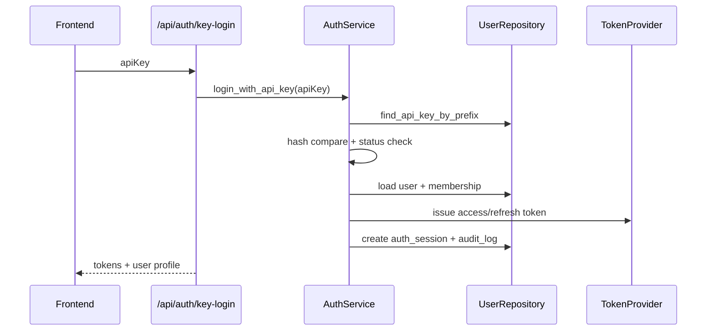

# 后端技术落地方案 - user_management
> Version: v0.2.1
> Last Updated: 2026-03-12
> Status: Draft

> Design Priority (v0.2.1): 若旧段落与 v0.2.0/v0.2.1 新增澄清冲突，以最新澄清为准。

## 1. 模块边界与服务分层

### 1.1 新增模块

1. `app/api/auth.py`：认证接口。
2. `app/api/admin_users.py`、`app/api/admin_api_keys.py`：管理员接口（Phase 2 起启用）。
3. `app/core/security.py`：JWT 签发/校验、密码学工具。
4. `app/services/auth_service.py`：登录、刷新、登出、获取当前用户。
5. `app/services/admin_user_service.py`：用户与密钥管理。
6. `app/repositories/user_repository.py`：用户域持久化。
7. `app/models/user_management.py`：组织、用户、成员关系、密钥、会话、审计。

### 1.2 与既有模块关系

1. `verify_api_token` 逐步退役，替换为 `get_current_user`。
2. `PreReviewService/FileService/HistoryService` 通过 `current_user` 做数据隔离与归属写入。
3. `PreReviewRepository` 增加按 `org_id/user_id` 过滤查询能力。

## 2. 接口与流程编排

### 2.1 认证流程

### 2.2 鉴权注入流程

1. 路由依赖 `Depends(get_current_user)`。
2. 解析 access token -> 验证签名/过期/session 状态。
3. 注入 `CurrentUserContext`（`user_id/org_id/role`）。

### 2.4 认证传输策略澄清（v0.2.0）

> Obsolete in v0.2.0: 旧版 `refresh/logout` 默认接收请求体 refresh token 的描述不再作为主路径。

本版本约束：

1. `POST /api/auth/key-login`：
- 响应体返回 `accessToken`。
- 同时通过 `Set-Cookie` 下发 `refresh_token` 与 `csrf_token`。
2. `POST /api/auth/refresh`：
- 默认无请求体。
- 通过 Cookie 获取 `refresh_token`，并验证 `X-CSRF-Token`。
3. `POST /api/auth/logout`：
- 默认无请求体，注销当前设备会话（由当前 refresh session 决定）。
- `allDevices=true` 由 access token 身份触发，批量注销本人会话。

### 2.3 管理流程（Phase 2）

1. 创建用户。
2. 分配角色与组织 membership。
3. 签发 API Key（返回一次明文）。
4. 吊销 API Key、禁用用户。

## 3. 持久化与一致性策略

### 3.1 新增表

1. `organizations`
2. `users`
3. `memberships`（`user_id + org_id` 唯一）
4. `api_keys`（`key_hash` 唯一）
5. `auth_sessions`
6. `audit_logs`

### 3.2 既有表迁移

为 `requests/sessions/uploaded_files` 新增：

1. `org_id`（索引）
2. `created_by_user_id`（索引）

### 3.5 数据可见范围规则（v0.2.0）

1. 第一层：`org_id` 强隔离。
2. 第二层：角色过滤。
- `OWNER/ADMIN`：组织全量。
- `MEMBER`：`created_by_user_id=self`。
- `VIEWER`：只读组织全量。
3. 对 `MEMBER` 的 regenerate 仅允许作用于本人可见会话。

### 3.3 事务与一致性

1. `key-login`：会话创建与审计写入同事务。
2. `refresh`：refresh token 轮换 + session 更新时间同事务。
3. `revoke key`：更新 key 状态并立即使对应会话失效（可通过 `revoked_before` 逻辑或批量失效）。

### 3.4 迁移策略

1. 新增 Alembic 管理 schema（不再仅依赖 `create_all`）。
2. 先执行结构迁移，再执行数据回填脚本。

## 4. 模型/工具接入策略

1. 引入 `python-jose` 或 `PyJWT` 做 JWT。
2. API Key 哈希：`sha256(salt + key + pepper)`。
3. `pepper` 来源环境变量，不入库。
4. `api_key` 生成：前缀 + 随机密文（如 `cpk_live_xxx`）。

## 5. 错误处理与可观测性

### 5.1 错误码

1. `AUTH_ERROR`
2. `TOKEN_EXPIRED`
3. `PERMISSION_DENIED`
4. `USER_DISABLED`
5. `API_KEY_REVOKED`
6. `RATE_LIMITED`
7. `VALIDATION_ERROR`
8. `PERSISTENCE_ERROR`

### 5.2 日志与审计

1. 应用日志：`request_id/user_id/org_id/path/error_code`。
2. 审计日志：登录成功/失败、refresh、logout、创建用户、禁用用户、签发/吊销 key。
3. 对管理员操作记录 `actor_user_id` 与目标对象。

### 5.3 限流策略（Phase 3）

1. 登录接口按 IP + key 前缀限流。
2. 管理接口按用户限流。

### 5.4 权限矩阵（v0.2.0）

| 接口 | OWNER | ADMIN | MEMBER | VIEWER |
|---|---|---|---|---|
| `POST /api/auth/key-login` | ✅ | ✅ | ✅ | ✅ |
| `POST /api/auth/refresh` | ✅ | ✅ | ✅ | ✅ |
| `POST /api/auth/logout` | ✅ | ✅ | ✅ | ✅ |
| `GET /api/auth/me` | ✅ | ✅ | ✅ | ✅ |
| `POST /api/prereview` | ✅ | ✅ | ✅ | ❌ |
| `POST /api/prereview/{id}/regenerate` | ✅ | ✅ | ✅(本人数据) | ❌ |
| `GET /api/prereview/{id}` | ✅ | ✅ | ✅(本人数据) | ✅ |
| `GET /api/prereview/history` | ✅ | ✅ | ✅(本人数据) | ✅ |
| `POST /api/files/upload` | ✅ | ✅ | ✅ | ❌ |
| `GET /api/admin/users` | ✅ | ✅ | ❌ | ❌ |
| `POST /api/admin/users` | ✅ | ✅ | ❌ | ❌ |
| `PATCH /api/admin/users/*` | ✅ | ✅ | ❌ | ❌ |
| `POST/GET /api/admin/api-keys*` | ✅ | ✅ | ❌ | ❌ |

## 6. 阶段映射（Phase 1..N）

### Phase 1（最小可用）

1. 数据模型与迁移。
2. `auth` 接口与 JWT。
3. 业务接口接入用户上下文。
4. 数据归属字段写入与查询隔离。

### Phase 2（治理增强）

1. 管理员 API：用户、角色、密钥生命周期。
2. 审计查询接口。
3. 更完整的权限拦截中间层。

### Phase 3（安全与企业扩展）

1. 邀请制注册。
2. 风险控制与异常告警。
3. OIDC 兼容层抽象。

## 7. 风险点到技术实现映射（v0.2.1）

本节用于把 `01_overall_technical_design.md` 中 6.1/6.2 的风险与缓解策略落到可执行实现。

### 7.1 R1 鉴权切换兼容断档

风险来源：

1. 路由从静态 token 切换到 JWT 后，旧前端或脚本可能瞬时不可用。

技术实现：

1. 配置开关：
- `COPRODUCT_AUTH_MODE=legacy|hybrid|jwt`（默认 `jwt`）。
- `legacy`：仅静态 token（仅限 dev 紧急回滚）。
- `hybrid`：同时接受静态 token 与 JWT（灰度阶段使用）。
- `jwt`：仅 JWT（目标稳定态）。
2. 鉴权依赖实现：
- `get_current_user` 先验 JWT。
- 当 `auth_mode=hybrid` 且 JWT 校验失败时，走 `verify_api_token` 兼容分支。
3. 启动安全校验：
- `app_env=prod` 禁止 `auth_mode=legacy/hybrid`。
- `app_env=prod` 禁止 `COPRODUCT_API_TOKEN=dev-token`。
- 缺失 `JWT_SECRET/REFRESH_TOKEN_SECRET/CSRF_SECRET` 时拒绝启动。
4. 发布策略：
- 第 1 阶段 `hybrid`（24~72 小时），观察指标。
- 第 2 阶段切 `jwt`，并移除前端静态 token 依赖。

验收信号：

1. `hybrid -> jwt` 切换无 5xx 峰值。
2. 鉴权失败错误码分布符合预期（无大量未知错误）。

### 7.2 R2 历史数据归属不明确

风险来源：

1. `requests/sessions/uploaded_files` 新增 `org_id/created_by_user_id` 后，旧数据没有归属。

技术实现：

1. Schema 迁移分两步：
- Step A：新增字段可空 + 建索引。
- Step B：回填完成后再加非空约束（或逻辑非空校验）。
2. 回填脚本：
- `scripts/backfill_user_ownership.py`。
- 规则：按创建时间将历史数据挂到 `bootstrap_owner_user_id` 与 `default_org_id`。
3. 数据一致性校验 SQL（上线前必须执行）：
- `org_id is null` 行数为 0。
- `created_by_user_id is null` 行数为 0。
4. 读路径防御：
- 查询层若命中空归属记录，返回 `PERSISTENCE_ERROR` 并记录审计事件，禁止越权“全局放开”。

验收信号：

1. 回填后抽样记录可追溯到同一默认管理员。
2. `MEMBER` 访问历史数据不出现跨用户泄露。

### 7.3 R3 刷新会话复杂度与失效边界

风险来源：

1. refresh token 轮换、并发刷新、会话吊销、跨设备登出等边界复杂。

技术实现：

1. `auth_sessions` 增强字段：
- `id`, `user_id`, `org_id`
- `refresh_token_hash`
- `status` (`ACTIVE/REVOKED/EXPIRED`)
- `issued_at`, `expires_at`, `rotated_at`, `revoked_at`
- `device_id`, `ip`, `user_agent`
2. 轮换策略（One-time Refresh）：
- refresh 成功后立即替换 `refresh_token_hash`。
- 旧 refresh token 二次使用返回 `TOKEN_EXPIRED` 并审计。
3. 并发控制：
- 对 session 行使用乐观锁版本号或 `SELECT ... FOR UPDATE`（按 DB 能力选择）。
4. 登出策略：
- 当前设备登出：仅 revoke 当前 session。
- `allDevices=true`：revoke 当前用户所有 `ACTIVE` sessions。
5. 吊销联动：
- API key 被吊销时，联动 revoke 该 key 签发的 active sessions。

验收信号：

1. 同一 refresh token 重放会被稳定拒绝。
2. `allDevices=true` 后旧设备 refresh 失败且返回统一错误码。

### 7.4 可观测与告警实现

1. 指标：
- `auth_login_success_total`
- `auth_login_failure_total{error_code}`
- `auth_refresh_success_total`
- `auth_refresh_replay_block_total`
- `auth_legacy_fallback_total`（仅 hybrid 阶段）
2. 结构化日志必填：
- `request_id`, `user_id`, `org_id`, `session_id`, `auth_mode`, `error_code`
3. 告警阈值（建议）：
- 5 分钟内 `AUTH_ERROR` 激增 > 基线 3 倍告警。
- `auth_refresh_replay_block_total` 连续升高触发安全告警。

### 7.5 回滚动作清单（后端执行）

1. 故障分级：
- P1 鉴权全量失败：临时切 `auth_mode=hybrid`（仅非 prod），恢复可用性后定位。
- P2 局部 session 异常：清理异常 session 并强制重新登录。
2. 数据回滚：
- 严禁回滚删除用户归属字段；仅允许通过脚本修复归属映射。
3. 事后动作：
- 补审计记录、导出故障窗口日志、更新回归用例。
